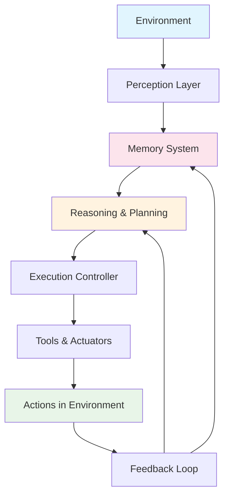

# Chapter 3: What is an AI Agent?

## Defining AI Agents

An **AI Agent** is a software system that can observe its environment, make autonomous decisions, and take actions to achieve specific goals. Unlike traditional software or simple chatbots, AI agents possess several key characteristics that make them truly intelligent and autonomous.

## Core Characteristics

### 🎯 Goal-Oriented Behavior

AI agents work towards specific objectives, not just responding to immediate prompts. They can:

- Set and pursue long-term goals
- Break complex objectives into manageable tasks
- Prioritize actions based on goal importance
- Adapt strategies when circumstances change

### 🧠 Autonomous Decision Making

Agents can make decisions independently using:

- **Reasoning**: Logical analysis of situations
- **Planning**: Strategic thinking about future actions
- **Judgment**: Evaluating options and consequences
- **Learning**: Improving decisions based on experience

### 🔄 Continuous Operation

Unlike request-response systems, agents can:

- Initiate actions proactively
- Monitor environments for changes
- Maintain persistent workflows
- Operate without constant human supervision

### 🧰 Tool Integration

Agents extend their capabilities by using:

- External APIs and web services
- Databases and file systems
- Other software applications
- Physical devices and sensors

## What is an Environment in AI Agents?

In the context of AI agents, an **environment** refers to the world or system the agent interacts with. This includes:

### Environmental Components

- **External systems**: APIs, databases, web services
- **User interfaces**: Chat systems, web pages, mobile apps
- **Data sources**: Files, sensors, real-time feeds
- **Other agents**: Collaborative or competitive entities

### Environmental States

Agents perceive their environment through:

- **Current conditions**: System status, user inputs, data values
- **Historical patterns**: Trends, previous interactions, learned behaviors
- **Available actions**: What the agent can do in the current state
- **Constraints**: Limitations, permissions, resource availability

### Examples of Agent Environments

**Chatbot Environment**:

- User input text
- Knowledge base
- Conversation history
- Available response templates

**DevOps Agent Environment**:

- Server metrics and logs
- Deployment pipelines
- Alert systems
- Infrastructure APIs

**Research Agent Environment**:

- Web search engines
- Document databases
- Analysis tools
- Report generation systems

## Agent vs Traditional Software

| Aspect          | Traditional Software      | AI Agent                |
| --------------- | ------------------------- | ----------------------- |
| **Behavior**    | Rule-based, predictable   | Goal-based, adaptive    |
| **Interaction** | User-initiated (UI)       | Can initiate actions    |
| **State**       | Stateless or simple state | Rich, persistent memory |
| **Logic**       | Deterministic algorithms  | Probabilistic reasoning |
| **Adaptation**  | Requires code changes     | Learns and adapts       |
| **Integration** | Fixed API connections     | Dynamic tool selection  |

## Components of an AI Agent

### 1. Perception Layer

**Function**: Gather and process environmental input

**Capabilities**:

- Text processing and understanding
- Image and video analysis
- Sensor data interpretation
- API response handling
- Real-time monitoring

**Implementation**:

```python
class PerceptionLayer:
    def observe(self, environment):
        # Process incoming data
        text_input = environment.get_text()
        api_data = environment.get_api_responses()
        sensor_data = environment.get_sensor_readings()

        return {
            'text': text_input,
            'data': api_data,
            'sensors': sensor_data
        }
```

### 2. Reasoning & Planning Engine

**Function**: Analyze situations and make decisions

**Capabilities**:

- Goal decomposition
- Strategy formulation
- Risk assessment
- Resource allocation
- Contingency planning

**Planning Approaches**:

- **Forward planning**: Start from current state, plan toward goal
- **Backward planning**: Start from goal, work backward to current state
- **Hierarchical planning**: Break complex goals into sub-goals
- **Reactive planning**: Adapt plans based on real-time feedback

### 3. Memory System

**Function**: Store and retrieve information

**Memory Types**:

- **Working memory**: Current task context and immediate goals
- **Episodic memory**: Specific interactions and experiences
- **Semantic memory**: General knowledge and learned facts
- **Procedural memory**: How to perform tasks and use tools

**Implementation Patterns**:

```python
class AgentMemory:
    def __init__(self):
        self.working_memory = {}
        self.long_term_storage = VectorDatabase()
        self.conversation_history = []

    def store(self, key, value, memory_type='working'):
        if memory_type == 'working':
            self.working_memory[key] = value
        else:
            self.long_term_storage.add(key, value)

    def retrieve(self, query):
        return self.long_term_storage.search(query)
```

### 4. Tools & Actuators

**Function**: Execute actions in the environment

**Tool Categories**:

- **Information tools**: Search, databases, APIs
- **Communication tools**: Email, messaging, notifications
- **Creation tools**: File generation, image creation, code writing
- **Analysis tools**: Data processing, visualization, reporting
- **Automation tools**: System control, deployment, monitoring

### 5. Execution Controller

**Function**: Orchestrate agent activities

**Responsibilities**:

- Task scheduling and prioritization
- Resource management
- Error handling and recovery
- Performance monitoring
- Security and permissions

### 6. Feedback Loop

**Function**: Learn and improve performance

**Learning Mechanisms**:

- **Success/failure analysis**: Evaluate action outcomes
- **Performance metrics**: Track efficiency and accuracy
- **User feedback**: Incorporate human guidance
- **Environmental changes**: Adapt to new conditions

## Agent Architecture Flow



## Generative AI vs Agentic AI

Understanding the distinction between generative and agentic AI is crucial:

### Generative AI

**Focus**: Content creation and pattern-based responses

**Characteristics**:

- Single-shot interactions
- Stateless operation
- Content generation (text, images, code)
- Reactive to prompts
- No tool usage or external actions

**Examples**: GPT-4, DALL-E, Stable Diffusion

### Agentic AI

**Focus**: Goal achievement through autonomous action

**Characteristics**:

- Multi-step workflows
- Stateful with persistent memory
- Tool usage and external integrations
- Proactive behavior
- Learning and adaptation

**Examples**: AutoGPT, LangChain agents, autonomous research assistants

### Comparison Table

| Feature               | Generative AI            | Agentic AI                 |
| --------------------- | ------------------------ | -------------------------- |
| **Core Function**     | Content generation       | Task completion            |
| **Interaction Style** | Single prompt → response | Multi-turn dialogue        |
| **Memory**            | Stateless                | Persistent memory          |
| **Tool Usage**        | None or minimal          | Extensive tool integration |
| **Autonomy**          | Low (reactive)           | High (proactive)           |
| **Planning**          | None                     | Multi-step planning        |
| **Learning**          | Pre-training only        | Continuous learning        |

## The Rise of Agentic AI

**Agentic AI** represents a design philosophy where AI systems possess "agency" - the ability to independently decide, plan, and act. This emergence is driven by:

### Key Enablers

1. **Advanced LLMs**: Powerful reasoning and language understanding
2. **Tool Integration**: APIs and services for extended capabilities
3. **Memory Technologies**: Vector databases and persistent storage
4. **Orchestration Frameworks**: LangChain, LangGraph, CrewAI

### Market Drivers

- **Automation demand**: Need for end-to-end process automation
- **Complexity handling**: Managing increasingly complex business workflows
- **Cost efficiency**: Reducing human intervention in routine tasks
- **24/7 operations**: Always-on business requirements

## Real-World Agent Applications

### Customer Support Agent

**Environment**: Help desk system, knowledge base, customer database
**Goal**: Resolve customer issues efficiently
**Actions**: Search knowledge base, escalate to humans, update tickets
**Tools**: CRM systems, documentation, communication channels

### DevOps Agent

**Environment**: Cloud infrastructure, monitoring systems, deployment pipelines
**Goal**: Maintain system health and performance
**Actions**: Monitor metrics, restart services, deploy updates, alert teams
**Tools**: AWS/Azure APIs, Kubernetes, monitoring tools, Slack/email

### Research Agent

**Environment**: Internet, academic databases, analysis tools
**Goal**: Gather and synthesize information on specific topics
**Actions**: Search, summarize, analyze, generate reports
**Tools**: Web search, PDF readers, data analysis, report generators

### Sales Agent

**Environment**: CRM system, email, social media, prospect databases
**Goal**: Identify and qualify leads, nurture relationships
**Actions**: Prospect research, outreach, follow-up, meeting scheduling
**Tools**: LinkedIn, email systems, calendar, CRM integration

## Building Your First Agent

### Conceptual Framework

1. **Define the goal**: What should the agent achieve?
2. **Map the environment**: What systems will it interact with?
3. **Identify tools**: What capabilities does it need?
4. **Design the workflow**: How will it approach the goal?
5. **Implement memory**: What should it remember?
6. **Add feedback loops**: How will it improve?

### Simple Agent Example

```python
class SimpleResearchAgent:
    def __init__(self):
        self.goal = "Research and summarize topics"
        self.tools = [WebSearchTool(), SummaryTool()]
        self.memory = []

    def execute(self, topic):
        # Plan the research
        search_queries = self.generate_queries(topic)

        # Execute research
        results = []
        for query in search_queries:
            data = self.tools[0].search(query)
            summary = self.tools[1].summarize(data)
            results.append(summary)

        # Store in memory
        self.memory.append({
            'topic': topic,
            'results': results,
            'timestamp': datetime.now()
        })

        return self.synthesize_findings(results)
```

## Key Takeaways

1. **AI agents** are autonomous systems that can perceive, reason, and act
2. **Environment interaction** is fundamental to agent functionality
3. **Tool integration** extends agent capabilities beyond text generation
4. **Memory systems** enable persistent, contextual behavior
5. **Agentic AI** represents a shift from reactive to proactive systems

## What's Next?

Now that we understand what AI agents are and how they work, let's explore the different **types of agents and design patterns** in Chapter 4.
