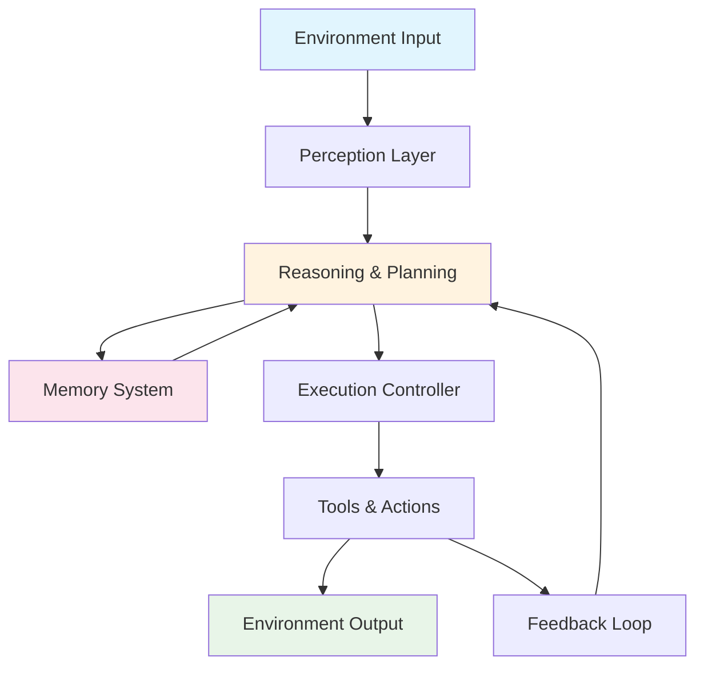

# Chapter 1: Foundations

## What Are AI Agents?

An **AI Agent** is a software system that can perceive its environment, make decisions, and take actions to achieve specific goals. Unlike traditional software that follows predetermined rules or simple chatbots that respond to prompts, AI agents are autonomous systems capable of:

- **Observing** inputs (text, data, APIs, sensors)
- **Planning** intelligently based on goals
- **Taking actions** autonomously using tools and APIs
- **Remembering** past context and interactions
- **Learning** from outcomes and feedback

## Key Characteristics

### 🎯 Goal-Oriented Behavior

AI agents work towards specific objectives, breaking down complex tasks into manageable steps.

### 🧠 Autonomous Decision Making

They can make decisions without constant human input, using reasoning and planning capabilities.

### 🔄 Persistent Memory

Unlike stateless systems, agents maintain context across interactions and can learn from past experiences.

### 🛠️ Tool Integration

Agents can use external tools, APIs, and services to extend their capabilities beyond text generation.

## AI Agent vs Traditional Software

| Traditional Software | AI Agent                    |
| -------------------- | --------------------------- |
| Rule-based           | Goal-based reasoning        |
| Reactive UI          | Can initiate actions        |
| Stateless            | Can retain context          |
| Deterministic        | Probabilistic / fuzzy logic |
| Pre-programmed logic | Dynamic decision making     |

## AI Agent vs LLM (Large Language Model)

| Feature/Aspect        | LLM                       | AI Agent                               |
| --------------------- | ------------------------- | -------------------------------------- |
| **Core Function**     | Text generation, Q&A      | Autonomous task execution              |
| **Interaction Style** | Single prompt → response  | Multi-turn, goal-oriented              |
| **Memory**            | Short-term context window | Long-term persistent memory            |
| **Tool Usage**        | Limited or none           | Integrates with external tools         |
| **Autonomy**          | Reactive to prompts       | Proactive planning and execution       |
| **Architecture**      | Single model inference    | Orchestration of models, tools, memory |

## What Is Function Calling?

**Function calling** allows language models to call external functions, APIs, or services based on user intent. Instead of just returning text, the model can:

1. Identify when an action is needed
2. Format the function call with proper arguments
3. Delegate the task to external systems

### Example: Function Calling Flow

```json
User: "What's the weather in Seattle today?"

LLM Response:
{
  "function_call": {
    "name": "get_weather",
    "arguments": {
      "location": "Seattle"
    }
  }
}

System executes function and returns: "72°F, sunny"

Final response: "It's 72°F and sunny in Seattle today."
```

## Function Calling vs AI Agents

| Aspect           | Function Calling           | AI Agents             |
| ---------------- | -------------------------- | --------------------- |
| **Purpose**      | Execute specific functions | Achieve complex goals |
| **Intelligence** | Reactive function mapping  | Multi-step reasoning  |
| **Workflow**     | Single-turn execution      | Multi-step, stateful  |
| **Memory**       | Stateless per call         | Maintains context     |
| **Planning**     | None                       | Goal decomposition    |

## Core Components of an AI Agent

### 1. Perception Layer

- Gathers input from environment (text, images, API responses)
- Processes and interprets incoming data
- Maintains awareness of current state

### 2. Reasoning & Planning Engine

- Analyzes current situation and goals
- Breaks down complex tasks into steps
- Makes decisions about next actions

### 3. Memory System

- Short-term: Current conversation context
- Long-term: Historical interactions and learned patterns
- Knowledge base: Domain-specific information

### 4. Tool & Action Layer

- External APIs and services
- File system operations
- Database queries
- Web automation capabilities

### 5. Execution Controller

- Orchestrates the agent workflow
- Manages tool usage and coordination
- Handles error recovery and retries

### 6. Feedback Loop

- Monitors action results
- Evaluates success/failure
- Enables learning and improvement

## Agent Architecture Diagram



## Why AI Agents Matter

### Business Value

- **Automation**: Handle complex workflows end-to-end
- **Scalability**: Operate 24/7 without human intervention
- **Consistency**: Reliable execution of processes
- **Efficiency**: Faster than manual processes

### Technical Advantages

- **Composability**: Can be combined and orchestrated
- **Adaptability**: Learn and improve over time
- **Integration**: Connect disparate systems and services
- **Intelligence**: Make decisions in uncertain environments

## Real-World Applications

- **Customer Support**: Intelligent ticket resolution
- **DevOps**: Automated incident response
- **Sales**: Personalized outreach and lead qualification
- **Research**: Information gathering and analysis
- **Content Creation**: Automated writing and editing workflows

## Next Steps

Now that you understand the foundations of AI agents, let's explore how software has evolved to make these systems possible in **Chapter 2: Evolution of Software**.
