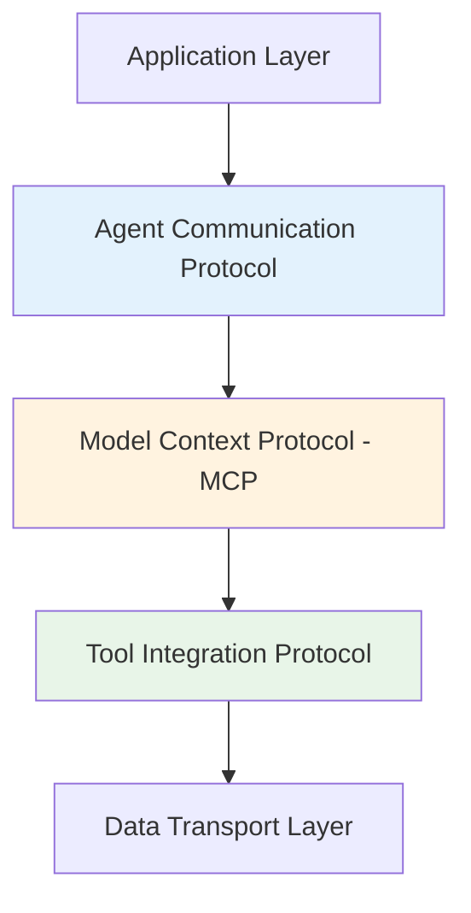

# Chapter 6: AI Frameworks Evolution

## The Daily Transformation of AI

AI is no longer a static field with yearly updates. We're experiencing **daily evolution** where new models, frameworks, and protocols continuously redefine how we build, interact with, and trust AI systems. This represents the fastest technological evolution in human history.

## The Acceleration of Innovation

### Weekly Model Releases

The pace of AI development has dramatically accelerated:

- **New models** released weekly, not yearly
- **Incremental improvements** in context length, reasoning, and speed
- **Multimodal capabilities** becoming standard
- **Specialized models** for specific domains and tasks

### Outpacing Human Adoption

- Innovation speed exceeds human learning curves
- Constant adaptation required for developers
- Continuous education becomes essential
- Traditional training cycles become obsolete

## From Model-Centric to Ecosystem-Centric

### The Old Paradigm: Isolated Models

**Yesterday's AI**:

- Closed, monolithic systems
- Single-purpose applications
- Isolated training and deployment
- Limited interoperability

**Characteristics**:

```
Model → Application → User
```

### The New Paradigm: Connected Ecosystems

**Today's AI**:

- Composable, interconnected systems
- Multi-purpose, adaptive applications
- Continuous learning and improvement
- Extensive interoperability

**Architecture**:

```
Models ↔ Protocols ↔ Agents ↔ Tools ↔ Environments
```

## Protocol-Driven AI Collaboration

### Why Protocols Matter

Just as the internet required **TCP/IP** for universal communication, AI systems now need standardized protocols for:

- **Interoperability**: Different AI systems working together
- **Scalability**: Building complex, distributed AI applications
- **Reliability**: Consistent behavior across systems
- **Security**: Safe communication and data sharing

### The Protocol Stack



## Model Context Protocol (MCP)

### What is MCP?

**Model Context Protocol** is the emerging standard for AI agent and tool communication, often called **"The USB for AI Agents."**

### Core Principles

**Standardized Communication**:

- Universal interface for agent interactions
- Consistent data formats and exchange patterns
- Cross-platform compatibility

**Context Preservation**:

- Maintains conversation state across systems
- Preserves memory and learned behaviors
- Enables seamless handoffs between agents

**Security and Trust**:

- Secure communication channels
- Authentication and authorization
- Data privacy protection

### MCP Components

**1. Context Management**

```json
{
  "context_id": "uuid-v4",
  "session_state": {
    "memory": [...],
    "goals": [...],
    "history": [...]
  },
  "metadata": {
    "created": "timestamp",
    "last_updated": "timestamp"
  }
}
```

**2. Agent Interface**

```json
{
  "agent_id": "research-agent-v1",
  "capabilities": ["search", "analyze", "summarize"],
  "tools": ["web_search", "pdf_reader"],
  "protocols": ["mcp-v1.0"]
}
```

**3. Tool Registry**

```json
{
  "tool_name": "web_search",
  "version": "1.2.0",
  "interface": "mcp-standard",
  "parameters": {...},
  "security_requirements": [...]
}
```

### Implementation Example

```python
class MCPAgent:
    def __init__(self, agent_config):
        self.mcp_client = MCPClient(agent_config)
        self.context = MCPContext()

    def process_request(self, request):
        # Standardized request handling
        mcp_request = self.mcp_client.parse_request(request)

        # Context-aware processing
        response = self.process_with_context(
            mcp_request,
            self.context
        )

        # Update context
        self.context.update(response.context_changes)

        return self.mcp_client.format_response(response)

    def collaborate_with_agent(self, other_agent_id, task):
        # Cross-agent collaboration via MCP
        collaboration_session = self.mcp_client.create_session(
            participants=[self.agent_id, other_agent_id]
        )

        return collaboration_session.execute_task(task)
```

## Agent-to-Agent (A2A) Communication

### Beyond Single Agents

**A2A enables**:

- **Multi-agent coordination** for complex tasks
- **Specialized agent collaboration** with different expertise
- **Task delegation** and result aggregation
- **Fault tolerance** through agent redundancy

### Communication Patterns

**1. Hierarchical Coordination**

```
Manager Agent
├── Research Agent
├── Analysis Agent
└── Report Agent
```

**2. Peer-to-Peer Collaboration**

```
Agent A ←→ Agent B ←→ Agent C
    ↓         ↓         ↓
  Task 1   Task 2   Task 3
```

**3. Pipeline Processing**

```
Input → Agent 1 → Agent 2 → Agent 3 → Output
```

### A2A Implementation

```python
class A2ACoordinator:
    def __init__(self):
        self.agents = {}
        self.communication_hub = A2AHub()

    def register_agent(self, agent):
        self.agents[agent.id] = agent
        self.communication_hub.connect(agent)

    def coordinate_task(self, complex_task):
        # Decompose task
        subtasks = self.decompose_task(complex_task)

        # Assign to appropriate agents
        assignments = {}
        for subtask in subtasks:
            best_agent = self.select_agent_for_task(subtask)
            assignments[subtask.id] = best_agent

        # Execute with coordination
        return self.execute_coordinated(assignments)

    def execute_coordinated(self, assignments):
        results = {}

        # Parallel execution where possible
        for subtask_id, agent in assignments.items():
            result = agent.execute_with_coordination(
                subtask=subtask_id,
                coordinator=self,
                peer_agents=self.agents
            )
            results[subtask_id] = result

        return self.aggregate_results(results)
```

## Determinism and Reliability

### The Challenge: AI Unpredictability

Traditional AI faced reliability issues:

- **Non-deterministic outputs** from the same input
- **Hallucinations** and fabricated information
- **Inconsistent reasoning** paths
- **Difficult debugging** and testing

### Solutions: Making AI Predictable

**1. Deterministic Inference Engines**

```python
class DeterministicAgent:
    def __init__(self, model_config):
        self.model = load_model(model_config)
        self.inference_engine = DeterministicEngine(
            temperature=0.0,
            seed=42,
            top_p=1.0
        )

    def generate_response(self, input_text):
        # Guaranteed same output for same input
        return self.inference_engine.generate(
            model=self.model,
            input=input_text,
            deterministic=True
        )
```

**2. Reproducible Reasoning Pipelines**

```python
class ReproduciblePipeline:
    def __init__(self):
        self.steps = []
        self.state_checkpoints = []

    def add_step(self, step_function):
        self.steps.append(step_function)

    def execute(self, input_data):
        current_state = input_data

        for i, step in enumerate(self.steps):
            # Save checkpoint for reproducibility
            self.state_checkpoints.append(
                copy.deepcopy(current_state)
            )

            current_state = step(current_state)

        return current_state

    def replay_from_checkpoint(self, checkpoint_index):
        # Reproduce execution from any point
        return self.state_checkpoints[checkpoint_index]
```

**3. Validation and Guardrails**

```python
class GuardrailAgent:
    def __init__(self, base_agent, validators):
        self.base_agent = base_agent
        self.validators = validators

    def execute(self, request):
        # Pre-execution validation
        for validator in self.validators:
            if not validator.validate_input(request):
                return validator.handle_invalid_input(request)

        # Execute with monitoring
        response = self.base_agent.execute(request)

        # Post-execution validation
        for validator in self.validators:
            if not validator.validate_output(response):
                return validator.handle_invalid_output(response)

        return response
```

## Tackling Hallucinations

### The Hallucination Problem

**Hallucinations** occur when AI systems generate false information confidently, including:

- Fabricated facts and statistics
- Non-existent references and citations
- Plausible but incorrect technical details
- Confident assertions about uncertain topics

### Solution Approaches

**1. Retrieval-Augmented Generation (RAG)**

```python
class RAGAgent:
    def __init__(self, knowledge_base, llm):
        self.knowledge_base = knowledge_base
        self.llm = llm

    def answer_question(self, question):
        # Retrieve relevant facts
        relevant_docs = self.knowledge_base.search(question)

        # Ground response in retrieved facts
        prompt = f"""
        Question: {question}

        Relevant information:
        {relevant_docs}

        Based only on the provided information, answer the question.
        If the information is insufficient, say so clearly.
        """

        return self.llm.generate(prompt)
```

**2. LLM Critics and Self-Reflection**

```python
class SelfCriticAgent:
    def __init__(self, generator_llm, critic_llm):
        self.generator = generator_llm
        self.critic = critic_llm

    def generate_with_criticism(self, prompt):
        # Initial generation
        response = self.generator.generate(prompt)

        # Self-criticism
        critique = self.critic.evaluate(
            prompt=prompt,
            response=response,
            criteria=["accuracy", "completeness", "relevance"]
        )

        # Revision if needed
        if critique.needs_revision:
            revised_response = self.generator.generate(
                prompt + f"\nPrevious attempt: {response}\n"
                f"Issues to address: {critique.issues}\n"
                "Provide an improved response:"
            )
            return revised_response

        return response
```

**3. Fact-Checking Integration**

```python
class FactCheckedAgent:
    def __init__(self, base_agent, fact_checker):
        self.base_agent = base_agent
        self.fact_checker = fact_checker

    def generate_response(self, query):
        response = self.base_agent.generate(query)

        # Extract factual claims
        claims = self.extract_claims(response)

        # Verify each claim
        verification_results = []
        for claim in claims:
            verification = self.fact_checker.verify(claim)
            verification_results.append(verification)

        # Flag or correct unverified claims
        corrected_response = self.apply_corrections(
            response,
            verification_results
        )

        return corrected_response
```

## Evaluation Frameworks: The New QA Layer

### Why Evaluation Matters

As AI systems become more complex, systematic evaluation becomes crucial for:

- **Quality assurance** before deployment
- **Performance monitoring** in production
- **Bias detection** and mitigation
- **Regression testing** after updates

### Leading Evaluation Frameworks

**1. TruLens**

- Evaluates truthfulness and hallucinations
- Provides groundedness scoring
- Tracks answer relevance

**2. PromptFoo**

- Automated prompt testing
- A/B testing for prompts
- Performance benchmarking

**3. DeepEval**

- Comprehensive LLM evaluation
- Custom metric development
- Continuous evaluation pipelines

**4. LangSmith**

- End-to-end LLM application testing
- Trace analysis and debugging
- Production monitoring

### Evaluation Implementation

```python
class ComprehensiveEvaluator:
    def __init__(self):
        self.metrics = [
            AccuracyMetric(),
            HallucinationMetric(),
            BiasMetric(),
            RelevanceMetric(),
            ConsistencyMetric()
        ]

    def evaluate_agent(self, agent, test_dataset):
        results = {}

        for test_case in test_dataset:
            response = agent.execute(test_case.input)

            case_results = {}
            for metric in self.metrics:
                score = metric.evaluate(
                    input=test_case.input,
                    output=response,
                    expected=test_case.expected
                )
                case_results[metric.name] = score

            results[test_case.id] = case_results

        return self.aggregate_results(results)
```

## AI as Infrastructure

### The Infrastructure Paradigm

AI is evolving from being a product to being the **underlying infrastructure** for modern applications:

**Traditional Stack**:

```
Application Layer
Business Logic Layer
Database Layer
Operating System
Hardware
```

**AI-Native Stack**:

```
User Interface Layer
Agent Orchestration Layer
AI Reasoning Layer
Knowledge & Memory Layer
Tool & Integration Layer
Data & Compute Layer
```

### LLM-Native Architectures

```python
class LLMNativeApplication:
    def __init__(self):
        self.reasoning_layer = LLMReasoningEngine()
        self.memory_layer = VectorDatabase()
        self.tool_layer = ToolRegistry()
        self.agent_layer = AgentOrchestrator()

    def process_request(self, user_request):
        # Every request goes through AI reasoning
        context = self.memory_layer.retrieve_context(user_request)

        reasoning_result = self.reasoning_layer.analyze(
            request=user_request,
            context=context
        )

        if reasoning_result.requires_tools:
            tool_results = self.tool_layer.execute(
                reasoning_result.tool_calls
            )

            final_result = self.reasoning_layer.synthesize(
                reasoning_result,
                tool_results
            )
        else:
            final_result = reasoning_result

        # Update memory with new interaction
        self.memory_layer.store(
            user_request,
            final_result,
            metadata={"timestamp": datetime.now()}
        )

        return final_result
```

## The Enterprise Shift

### From PoCs to Production

Enterprises are transitioning from **proof-of-concepts** to **production deployments**:

**Key Concerns**:

- **Determinism**: Predictable, reproducible behavior
- **Cost control**: Managing computational expenses
- **Evaluation**: Systematic quality assurance
- **Compliance**: Meeting regulatory requirements

**Production Requirements**:

- **Monitoring**: Real-time performance tracking
- **Scaling**: Handle production workloads
- **Security**: Protect sensitive data
- **Governance**: Establish oversight mechanisms

### Private AI Stacks

```python
class EnterpriseAIStack:
    def __init__(self):
        self.private_models = LocalModelRegistry()
        self.secure_memory = EncryptedVectorDB()
        self.compliance_layer = ComplianceEngine()
        self.monitoring = ProductionMonitor()

    def deploy_agent(self, agent_config):
        # Compliance check
        compliance_result = self.compliance_layer.validate(
            agent_config
        )

        if not compliance_result.approved:
            raise ComplianceError(compliance_result.issues)

        # Deploy with monitoring
        agent = self.create_monitored_agent(agent_config)
        self.monitoring.register(agent)

        return agent

    def create_monitored_agent(self, config):
        base_agent = Agent(config)

        return MonitoredAgent(
            base_agent=base_agent,
            monitor=self.monitoring,
            compliance=self.compliance_layer
        )
```

## Ethical and Responsible AI

### The Responsibility Imperative

With increased AI power comes increased responsibility:

**Key Principles**:

- **Transparency**: Clear explanation of AI decisions
- **Accountability**: Clear responsibility chains
- **Fairness**: Bias detection and mitigation
- **Privacy**: Data protection and user rights

**Implementation Framework**:

```python
class EthicalAIFramework:
    def __init__(self):
        self.transparency_engine = ExplanationGenerator()
        self.bias_detector = BiasAnalyzer()
        self.privacy_protector = DataAnonymizer()
        self.audit_system = EthicsAuditor()

    def ethical_agent_wrapper(self, base_agent):
        return EthicalAgent(
            base_agent=base_agent,
            transparency=self.transparency_engine,
            bias_detection=self.bias_detector,
            privacy_protection=self.privacy_protector,
            auditing=self.audit_system
        )
```

### Human-in-the-Loop Integration

**Essential Components**:

- **Override mechanisms**: Humans can intervene
- **Explanation systems**: AI explains its reasoning
- **Escalation protocols**: Complex cases go to humans
- **Feedback loops**: Human input improves AI

## The Future: Self-Evolving AI

### Autonomous Improvement

The next frontier involves AI systems that can:

- **Self-diagnose** performance issues
- **Self-improve** through experience
- **Self-correct** errors and biases
- **Self-optimize** for efficiency

### Multi-Agent Evolution

```python
class EvolvingAgentEcosystem:
    def __init__(self):
        self.agent_population = []
        self.performance_tracker = MetricsCollector()
        self.evolution_engine = EvolutionaryOptimizer()

    def evolve_ecosystem(self):
        # Evaluate current agent performance
        performance_data = self.performance_tracker.analyze()

        # Identify improvement opportunities
        optimization_targets = self.evolution_engine.identify_targets(
            performance_data
        )

        # Generate improved agent variants
        new_agents = []
        for target in optimization_targets:
            improved_agent = self.evolution_engine.optimize_agent(
                base_agent=target.agent,
                optimization_goal=target.goal
            )
            new_agents.append(improved_agent)

        # Test and deploy improvements
        for agent in new_agents:
            if self.validate_improvement(agent):
                self.deploy_improved_agent(agent)
```

## Key Takeaways

1. **Daily evolution** requires continuous adaptation and learning
2. **Protocol standardization** enables interoperability and scale
3. **MCP and A2A** provide the foundation for agent ecosystems
4. **Determinism and evaluation** are essential for production deployment
5. **Ethical frameworks** ensure responsible AI development
6. **Self-evolving systems** represent the future of AI

## The Path Forward

As AI frameworks continue to evolve at breakneck speed, success depends on:

- **Staying informed** about emerging standards and protocols
- **Building with flexibility** to adapt to new paradigms
- **Prioritizing reliability** and ethical considerations
- **Embracing collaboration** between humans and AI systems

The future is not just AI-powered—it's AI-native, where intelligence is woven into the fabric of every application and interaction.

---

_"We're not just building AI tools; we're creating the intelligent infrastructure that will power the next generation of human-AI collaboration."_
