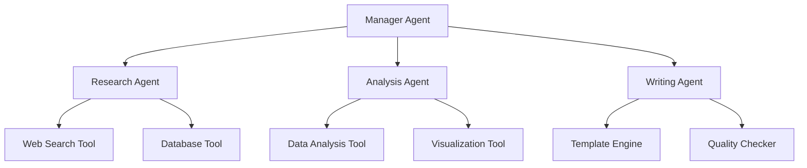

# Chapter 4: Agent Types & Patterns

## Types of AI Agents

AI agents can be categorized based on their capabilities, complexity, and interaction patterns. Understanding these types helps in selecting the right approach for specific use cases.

## Agent Classification by Capability

### 🔄 Reactive Agents

**Basic "input → output" behavior with no memory or planning**

**Characteristics**:

- Stateless operation
- Immediate response to current input
- No planning or goal decomposition
- Simple stimulus-response mapping

**Use Cases**:

- Simple Q&A chatbots
- Basic text generation
- Single-turn conversations
- Immediate response systems

**Examples**:

- Vanilla LLM interactions (GPT-3.5, Claude)
- Basic customer service bots
- Simple text completion tools

**Implementation Pattern**:

```python
class ReactiveAgent:
    def __init__(self, llm):
        self.llm = llm

    def respond(self, input_text):
        return self.llm.generate(input_text)
```

### 🛠️ Tool-Using Agents

**Uses external tools/APIs via function calling**

**Characteristics**:

- Can call predefined functions
- Enhanced capabilities through external services
- Basic tool selection logic
- Structured function call formatting

**Use Cases**:

- Weather information retrieval
- Calculator functions
- Database queries
- API integrations

**Examples**:

- GPT-4 with function calling
- Claude with tools
- ChatGPT plugins

**Tool Integration Pattern**:

```python
class ToolUsingAgent:
    def __init__(self, llm, tools):
        self.llm = llm
        self.tools = {tool.name: tool for tool in tools}

    def execute(self, query):
        # Determine if tools are needed
        response = self.llm.generate_with_tools(query, self.tools)

        if response.requires_tool:
            tool_result = self.tools[response.tool_name].execute(
                response.tool_args
            )
            return self.llm.synthesize(query, tool_result)

        return response.text
```

### 🧠 Planning Agents

**Plans multi-step actions to accomplish goals**

**Characteristics**:

- Task decomposition capabilities
- Sequential reasoning
- Tool chaining strategies
- Adaptive execution

**Planning Strategies**:

- **Chain of Thought**: Step-by-step reasoning
- **Tree of Thoughts**: Exploring multiple paths
- **ReAct**: Reasoning + Acting pattern
- **Plan-and-Execute**: Separate planning and execution phases

**Use Cases**:

- Research projects
- Multi-step problem solving
- Workflow automation
- Complex data analysis

**Examples**:

- AutoGPT
- ReAct agents
- LangChain planning agents

### 🧠💾 Memory-Augmented Agents

**Retains and recalls context from past interactions**

**Memory Types**:

- **Working Memory**: Current task context
- **Episodic Memory**: Specific interaction history
- **Semantic Memory**: General knowledge
- **Procedural Memory**: Task execution patterns

**Storage Technologies**:

- Vector databases (Pinecone, Weaviate, Chroma)
- Graph databases (Neo4j)
- Traditional databases with embeddings
- File-based storage systems

**Use Cases**:

- Personal assistants
- Customer support with history
- Long-term project management
- Personalized recommendations

### 🤖 Autonomous Agents

**Operates independently with feedback loops**

**Characteristics**:

- Self-correcting behavior
- Goal-oriented operation
- Minimal human supervision
- Adaptive learning mechanisms

**Key Features**:

- Performance monitoring
- Error recovery
- Dynamic strategy adjustment
- Continuous improvement

**Examples**:

- Autonomous software developers (Devin)
- Self-managing system agents
- Autonomous research assistants

### 👥 Multi-Agent Systems

**Coordinates multiple specialized agents**

**Coordination Patterns**:

- **Hierarchical**: Manager-worker relationships
- **Peer-to-peer**: Equal collaboration
- **Pipeline**: Sequential processing
- **Market-based**: Competitive task assignment

**Communication Protocols**:

- Direct messaging
- Shared memory spaces
- Event-driven notifications
- Auction-based coordination

**Examples**:

- CrewAI teams
- MetaGPT organizations
- LangGraph multi-agent workflows

## Agent Design Patterns

### 🔄 ReAct Pattern (Reasoning + Acting)

**Core Concept**: Alternates between reasoning and action steps

**Flow**:

1. **Thought**: Agent reasons about the problem
2. **Action**: Agent executes a specific tool/function
3. **Observation**: Agent observes the result
4. **Repeat**: Continue until goal achieved

**Example Implementation**:

```python
class ReActAgent:
    def execute_task(self, goal):
        thoughts = []
        while not self.goal_achieved(goal):
            # Reasoning step
            thought = self.reason(goal, thoughts)
            thoughts.append(thought)

            # Action step
            if thought.requires_action:
                action_result = self.execute_action(thought.action)
                thoughts.append(f"Observation: {action_result}")

        return self.synthesize_result(thoughts)
```

**Benefits**:

- Transparent reasoning process
- Error correction through observation
- Flexible tool usage
- Debuggable execution

### 🌲 Tree of Thoughts Pattern

**Core Concept**: Explores multiple reasoning paths simultaneously

**Process**:

1. Generate multiple initial approaches
2. Evaluate each approach's potential
3. Expand promising paths further
4. Prune unsuccessful branches
5. Select optimal solution path

**Use Cases**:

- Complex problem solving
- Strategic planning
- Creative tasks
- Optimization problems

### 🎯 Goal-Oriented Pattern

**Architecture Components**:

- **Goal Stack**: Hierarchical objective management
- **Planner**: Action sequence generation
- **Executor**: Action implementation
- **Monitor**: Progress tracking

**Goal Types**:

- Achievement goals (reach specific state)
- Maintenance goals (preserve conditions)
- Performance goals (optimize metrics)
- Avoidance goals (prevent outcomes)

### 🏭 Agent Factory Pattern

**Purpose**: Standardized agent creation and management

**Components**:

- Agent templates and configurations
- Resource allocation mechanisms
- Lifecycle management
- Performance monitoring

**Benefits**:

- Consistent agent deployment
- Efficient resource utilization
- Scalable agent provisioning
- Centralized configuration

### 🔄 Feedback Loop Pattern

**Learning Cycle**:

1. **Action**: Perform task
2. **Measurement**: Collect metrics
3. **Analysis**: Evaluate performance
4. **Adjustment**: Modify behavior
5. **Iteration**: Apply improvements

**Learning Mechanisms**:

- Reinforcement learning from rewards
- Supervised learning from examples
- Unsupervised pattern discovery
- Meta-learning (learning to learn)

## Agent Architecture Patterns

### 🏛️ Layered Architecture

**Layers**:

1. **Presentation Layer**: User interfaces and APIs
2. **Application Layer**: Business logic and workflows
3. **Domain Layer**: Core reasoning and knowledge
4. **Infrastructure Layer**: Tools, databases, external services

**Benefits**:

- Clear separation of concerns
- Modular design and testing
- Reusable components
- Maintainable codebase

### 🎪 Orchestrator Pattern

**Components**:

- **Central Orchestrator**: Workflow coordination
- **Agent Registry**: Available agent catalog
- **Task Queue**: Work distribution
- **Result Aggregator**: Output combination

**Workflow Types**:

- Sequential execution chains
- Parallel processing branches
- Conditional logic flows
- Loop-based iterations

### 🔀 State Machine Pattern

**Elements**:

- **States**: Discrete behavioral modes (idle, processing, learning)
- **Transitions**: State change rules
- **Events**: Transition triggers
- **Actions**: State-specific behaviors

**Example State Flow**:

```
Idle → (task received) → Processing
Processing → (task complete) → Learning
Learning → (update complete) → Idle
Any State → (error) → Error
Error → (recovery) → Idle
```

## Framework Implementations

### LangChain Agent Types

| Agent Type               | Description                    | Best For                   |
| ------------------------ | ------------------------------ | -------------------------- |
| **Zero-Shot ReAct**      | No prior examples needed       | General tasks, prototyping |
| **ReAct DocStore**       | Document retrieval + reasoning | Q&A systems, research      |
| **Self-Ask with Search** | Decomposes complex questions   | Multi-step research        |
| **Conversational ReAct** | Memory + conversation context  | Interactive applications   |
| **OpenAI Functions**     | Structured function calling    | Production APIs            |

### CrewAI Patterns

**Role-Based Teams**:

```python
crew = Crew(
    agents=[
        researcher_agent,
        analyst_agent,
        writer_agent
    ],
    tasks=[
        research_task,
        analysis_task,
        writing_task
    ],
    process=Process.sequential
)
```

### Multi-Agent Coordination

**Hierarchical Structure**:



## Selecting the Right Pattern

### Decision Framework

**Consider These Factors**:

1. **Task Complexity**: Simple vs. multi-step workflows
2. **Autonomy Requirements**: Human oversight vs. independent operation
3. **Integration Needs**: Number and complexity of external tools
4. **Memory Requirements**: Stateless vs. persistent context
5. **Scalability**: Single instance vs. distributed systems
6. **Real-time Constraints**: Response time requirements

### Pattern Selection Guide

| Use Case                   | Recommended Pattern    | Reasoning                      |
| -------------------------- | ---------------------- | ------------------------------ |
| **Simple Q&A**             | Reactive Agent         | No memory or tools needed      |
| **API Integration**        | Tool-Using Agent       | Structured external calls      |
| **Research Tasks**         | ReAct Planning Agent   | Multi-step reasoning required  |
| **Personal Assistant**     | Memory-Augmented Agent | Context continuity important   |
| **Complex Workflows**      | Multi-Agent System     | Task specialization beneficial |
| **Self-Improving Systems** | Feedback Loop Pattern  | Learning and adaptation needed |

## Performance Considerations

### Optimization Strategies

**Response Time**:

- Cache common operations
- Parallel tool execution
- Lazy loading of resources
- Efficient memory retrieval

**Resource Usage**:

- Agent pooling and reuse
- Memory cleanup strategies
- Tool connection management
- Graceful degradation

**Reliability**:

- Error handling and recovery
- Retry mechanisms with backoff
- Circuit breaker patterns
- Monitoring and alerting

## Best Practices

### Development Guidelines

1. **Start Simple**: Begin with reactive agents, add complexity gradually
2. **Clear Interfaces**: Define explicit agent APIs and contracts
3. **Comprehensive Testing**: Test each agent type thoroughly
4. **Monitor Performance**: Track metrics and user satisfaction
5. **Plan for Scale**: Design with growth in mind

### Deployment Considerations

1. **Security**: Implement proper authentication and authorization
2. **Monitoring**: Real-time performance and error tracking
3. **Versioning**: Manage agent updates and rollbacks
4. **Documentation**: Maintain clear usage guides and examples

## What's Next?

In the next chapter, we'll explore **Human-AI Collaboration** and learn how to design systems where humans and agents work together effectively.
