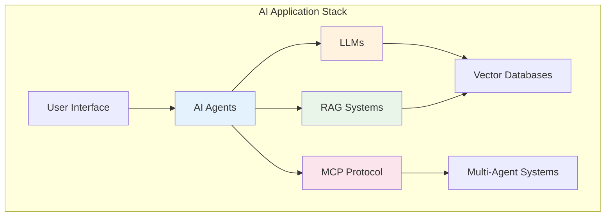

# The Complete Guide to AI Systems

Welcome to the comprehensive guide covering the essential technologies powering modern AI applications. This book provides in-depth coverage of AI Agents, Retrieval Augmented Generation (RAG), Large Language Models (LLMs), and Model Context Protocol (MCP).

## Why This Book Matters

We're witnessing the fastest technological evolution in history. AI systems are transforming from simple text generators to autonomous agents capable of reasoning, planning, and taking actions. This transformation requires understanding not just individual technologies, but how they work together to create intelligent, reliable systems.

## What You'll Learn

This book covers four critical areas that form the foundation of modern AI applications:

### Module 1: Large Language Models (LLMs)

**The Engine Behind AI Intelligence**

Understand the transformer-based models that power modern AI applications. Learn how these models work, how to fine-tune them, and how to deploy them effectively:

- Transformer architecture and attention mechanisms
- Training methodologies and fine-tuning techniques
- Deployment strategies and optimization
- Performance tuning and cost management
- Model selection and evaluation

**Key Chapters:**

- LLM fundamentals and architecture
- Deep dive into transformer models
- Training and fine-tuning strategies
- Deployment and serving architectures
- Performance optimization techniques

### Module 2: Retrieval Augmented Generation (RAG)

**Grounding AI in Real Knowledge**

Master the technique that connects LLMs to up-to-date, relevant information sources. RAG solves critical problems like hallucinations and knowledge cutoffs by integrating retrieval with generation:

- RAG architecture and system design
- Vector databases and embedding strategies
- Advanced retrieval techniques and optimization
- Production deployment and scaling
- Evaluation and performance monitoring

**Key Chapters:**

- RAG fundamentals and core concepts
- System architecture and component design
- Implementation with practical examples
- Advanced techniques and optimization
- Production deployment strategies

### Module 3: AI Agents

**From Static Code to Autonomous Systems**

Discover how software has evolved from rule-based programs to intelligent agents that can perceive, reason, and act autonomously. Learn about:

- The evolution from Software v1.0 to v3.0 (AI Agents)
- Core agent components: perception, reasoning, memory, and tools
- Agent types and design patterns
- Human-AI collaboration principles
- Building agents with LangChain, n8n, and other frameworks

**Key Chapters:**

- Foundations and core concepts
- Software evolution and paradigm shifts
- What makes an AI agent truly autonomous
- Agent types, patterns, and architectures
- Human-AI collaboration best practices
- AI frameworks evolution and ecosystem

### Module 4: Model Context Protocol (MCP)

**The Future of AI Interoperability**

Explore the emerging standard that enables seamless communication between AI agents, tools, and models. MCP is becoming the "USB for AI Agents":

- Protocol design and specification
- Agent-to-agent communication patterns
- Building interoperable AI systems
- Production deployment and scaling
- Future of AI ecosystem standards

**Key Chapters:**

- MCP overview and importance
- Protocol design and architecture
- Implementation and integration guide
- Multi-agent coordination patterns
- Production deployment strategies

## How to Use This Book

### Learning Path Options

**🎯 For Beginners**: Start with Module 1 (AI Agents) to build foundational understanding, then progress through each module sequentially.

**🔧 For Practitioners**: Jump to specific modules based on your immediate needs:

- Building intelligent applications → RAG (Module 2)
- Model deployment and optimization → LLMs (Module 3)
- Multi-agent systems → MCP (Module 4)

**📚 For Architects**: Focus on system design chapters in each module to understand how these technologies integrate in production environments.

### Prerequisites

- **Basic Programming**: Python experience preferred
- **API Familiarity**: Understanding REST APIs and web services
- **ML Basics**: Helpful but not required - we'll cover necessary concepts

## Real-World Applications

The technologies covered in this book power modern applications across industries:

**🏢 Enterprise**: Intelligent document processing, automated customer support, workflow orchestration

**💻 Development**: Code generation assistants, automated testing, intelligent DevOps

**🔬 Research**: Automated literature review, hypothesis generation, data analysis

**📈 Business**: Market research automation, content generation, decision support systems

## The Technology Landscape

## Why These Technologies Together?

Modern AI applications don't use just one technology—they combine multiple approaches:

- **AI Agents** provide the orchestration and decision-making layer
- **RAG** grounds responses in accurate, current information
- **LLMs** provide the language understanding and generation capabilities
- **MCP** enables different components to communicate and collaborate

Understanding how these technologies work together is essential for building production-ready AI systems.

## Book Philosophy

This book emphasizes:

**🔧 Practical Implementation**: Every concept includes working code examples
**🏗️ Production-Ready**: Focus on scalable, maintainable solutions
**🎯 Real-World Applications**: Examples from actual business use cases
**🔬 Deep Understanding**: Not just "how" but "why" and "when"
**🚀 Future-Oriented**: Preparing for rapid AI evolution

## Getting Started

Ready to dive in? Here's what we recommend:

1. **Start with the fundamentals** in Module 1 to understand AI agents
2. **Set up your development environment** with Python and key libraries
3. **Follow along with code examples** - all code is provided and explained
4. **Join the discussion** - engage with the community around these technologies

## Community and Support

This is a living document that evolves with the rapidly changing AI landscape. We encourage:

- **Practical experimentation** with the provided code examples
- **Community contributions** to keep content current
- **Real-world applications** of the concepts learned

---

_The future of software is agentic, intelligent, and collaborative. Let's build it together._

## 🚀 Start Your Journey

Choose your starting point based on your goals:

- **New to AI Agents?** → [Module 1: AI Agents](/ai-agents)
- **Need better AI accuracy?** → [Module 2: RAG](/rag)
- **Want to understand LLMs?** → [Module 3: LLMs](/llm)
- **Building multi-agent systems?** → [Module 4: MCP](/mcp)
