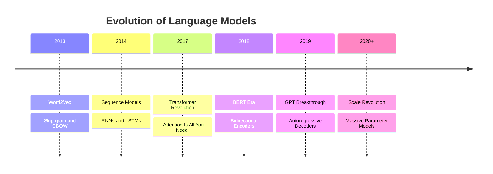

# Chapter 2: Model Architecture

## Deep Dive into Transformer Architecture

The Transformer architecture revolutionized natural language processing and forms the backbone of modern LLMs. This chapter explores the technical details of how transformers work and why they're so effective.

## Historical Context

### Evolution of Language Models



### Why Transformers?

Previous architectures had limitations:

- **RNNs**: Sequential processing, vanishing gradients
- **CNNs**: Limited receptive fields, local patterns only
- **LSTMs**: Better memory but still sequential

Transformers solved these with:

- **Parallel Processing**: All tokens processed simultaneously
- **Global Context**: Every token can attend to every other token
- **Scalability**: Architecture scales efficiently with parameters

## Core Architecture Components

### 1. Multi-Head Self-Attention

The heart of the transformer is the self-attention mechanism.

#### Attention Formula

```
Attention(Q, K, V) = softmax(QK^T / √d_k)V
```

Where:

- **Q** (Query): What information are we looking for?
- **K** (Key): What information is available?
- **V** (Value): The actual information content
- **d_k**: Dimension of key vectors (for scaling)

#### Multi-Head Mechanism

```python
class MultiHeadAttention:
    def __init__(self, d_model, n_heads):
        self.n_heads = n_heads
        self.d_k = d_model // n_heads

        self.W_q = Linear(d_model, d_model)
        self.W_k = Linear(d_model, d_model)
        self.W_v = Linear(d_model, d_model)
        self.W_o = Linear(d_model, d_model)

    def forward(self, x):
        # Split into multiple heads
        Q = self.W_q(x).view(batch, seq_len, n_heads, d_k)
        K = self.W_k(x).view(batch, seq_len, n_heads, d_k)
        V = self.W_v(x).view(batch, seq_len, n_heads, d_k)

        # Compute attention for each head
        attention_output = self.scaled_dot_product_attention(Q, K, V)

        # Concatenate heads and apply output projection
        output = self.W_o(attention_output.view(batch, seq_len, d_model))
        return output
```

### 2. Positional Encoding

Since transformers process all positions in parallel, they need explicit position information.

#### Sinusoidal Encoding

```python
def positional_encoding(seq_len, d_model):
    pos = torch.arange(seq_len).unsqueeze(1)
    div_term = torch.exp(torch.arange(0, d_model, 2) *
                        -(math.log(10000.0) / d_model))

    pe = torch.zeros(seq_len, d_model)
    pe[:, 0::2] = torch.sin(pos * div_term)  # Even positions
    pe[:, 1::2] = torch.cos(pos * div_term)  # Odd positions

    return pe
```

#### Learned Positional Embeddings

Modern models often use learned position embeddings:

```python
class LearnedPositionalEmbedding(nn.Module):
    def __init__(self, max_seq_len, d_model):
        super().__init__()
        self.embedding = nn.Embedding(max_seq_len, d_model)

    def forward(self, seq_len):
        positions = torch.arange(seq_len)
        return self.embedding(positions)
```

### 3. Feed-Forward Networks

Each transformer layer includes position-wise feed-forward networks:

```python
class FeedForward(nn.Module):
    def __init__(self, d_model, d_ff):
        super().__init__()
        self.linear1 = nn.Linear(d_model, d_ff)
        self.linear2 = nn.Linear(d_ff, d_model)
        self.activation = nn.ReLU()

    def forward(self, x):
        return self.linear2(self.activation(self.linear1(x)))
```

### 4. Layer Normalization and Residual Connections

```python
class TransformerBlock(nn.Module):
    def __init__(self, d_model, n_heads, d_ff):
        super().__init__()
        self.attention = MultiHeadAttention(d_model, n_heads)
        self.feed_forward = FeedForward(d_model, d_ff)
        self.norm1 = nn.LayerNorm(d_model)
        self.norm2 = nn.LayerNorm(d_model)

    def forward(self, x):
        # Self-attention with residual connection
        attn_output = self.attention(x)
        x = self.norm1(x + attn_output)

        # Feed-forward with residual connection
        ff_output = self.feed_forward(x)
        x = self.norm2(x + ff_output)

        return x
```

## Architecture Variants

### GPT (Generative Pre-trained Transformer)

**Decoder-Only Architecture**

```
Input Tokens → Embedding + Positional Encoding
↓
Masked Self-Attention Block 1
↓
Masked Self-Attention Block 2
↓
...
↓
Masked Self-Attention Block N
↓
Output Projection → Next Token Probabilities
```

Key Features:

- **Causal Masking**: Can only attend to previous tokens
- **Autoregressive**: Generates one token at a time
- **Unidirectional**: Information flows left-to-right

### BERT (Bidirectional Encoder Representations)

**Encoder-Only Architecture**

```
Input Tokens → Embedding + Positional Encoding
↓
Bidirectional Self-Attention Block 1
↓
Bidirectional Self-Attention Block 2
↓
...
↓
Bidirectional Self-Attention Block N
↓
Classification Head / MLM Head
```

Key Features:

- **Bidirectional**: Can attend to all tokens
- **Masked Language Modeling**: Predicts masked tokens
- **Understanding-focused**: Better for classification tasks

### T5 (Text-to-Text Transfer Transformer)

**Encoder-Decoder Architecture**

```
Input Sequence → Encoder → Encoded Representation
                             ↓
Output Sequence ← Decoder ← Encoded Representation
```

Key Features:

- **Text-to-Text**: All tasks as text generation
- **Encoder-Decoder**: Separate encoding and decoding
- **Flexible**: Handles various task formats

## Attention Patterns and Interpretability

### Attention Head Specialization

Different attention heads learn different patterns:

1. **Syntactic Heads**: Focus on grammatical relationships
2. **Semantic Heads**: Capture meaning relationships
3. **Positional Heads**: Track positional information
4. **Copy Heads**: Identify tokens to copy

### Visualization Example

```python
import matplotlib.pyplot as plt
import seaborn as sns

def visualize_attention(attention_weights, tokens):
    plt.figure(figsize=(10, 8))
    sns.heatmap(attention_weights,
                xticklabels=tokens,
                yticklabels=tokens,
                cmap='Blues')
    plt.title('Attention Pattern Visualization')
    plt.ylabel('Query Position')
    plt.xlabel('Key Position')
    plt.show()
```

## Modern Architectural Innovations

### 1. Rotary Position Embedding (RoPE)

Used in models like LLaMA and GPT-NeoX:

```python
def apply_rotary_pos_emb(x, freqs_cos, freqs_sin):
    # Split x into even and odd dimensions
    x1, x2 = x[..., ::2], x[..., 1::2]

    # Apply rotation
    rotated = torch.stack([
        x1 * freqs_cos - x2 * freqs_sin,
        x1 * freqs_sin + x2 * freqs_cos
    ], dim=-1).flatten(-2)

    return rotated
```

### 2. Grouped Query Attention (GQA)

Reduces memory usage in large models:

```python
class GroupedQueryAttention(nn.Module):
    def __init__(self, d_model, n_heads, n_kv_heads):
        self.n_heads = n_heads
        self.n_kv_heads = n_kv_heads  # Fewer KV heads
        self.head_dim = d_model // n_heads

        self.q_proj = nn.Linear(d_model, n_heads * self.head_dim)
        self.k_proj = nn.Linear(d_model, n_kv_heads * self.head_dim)
        self.v_proj = nn.Linear(d_model, n_kv_heads * self.head_dim)
```

### 3. Sliding Window Attention

Used in models like Longformer and BigBird:

```python
def sliding_window_attention(q, k, v, window_size):
    # Only attend to tokens within sliding window
    seq_len = q.size(1)
    attention_mask = torch.zeros(seq_len, seq_len)

    for i in range(seq_len):
        start = max(0, i - window_size)
        end = min(seq_len, i + window_size + 1)
        attention_mask[i, start:end] = 1

    return masked_attention(q, k, v, attention_mask)
```

## Architecture Design Choices

### Model Size vs. Performance

| Parameter       | Small (125M) | Medium (1.3B) | Large (6.7B) | XL (175B) |
| --------------- | ------------ | ------------- | ------------ | --------- |
| Layers          | 12           | 24            | 32           | 96        |
| Hidden Size     | 768          | 2048          | 4096         | 12288     |
| Attention Heads | 12           | 16            | 32           | 96        |
| Context Length  | 1024         | 2048          | 2048         | 2048      |

### Scaling Laws

Performance scales predictably with:

- **Parameters (N)**: Model size
- **Data (D)**: Training dataset size
- **Compute (C)**: Training FLOPs

```
Loss ∝ N^(-α) ∝ D^(-β) ∝ C^(-γ)
```

## Implementation Considerations

### Memory Optimization

1. **Gradient Checkpointing**: Trade compute for memory
2. **Mixed Precision**: Use FP16/BF16 training
3. **Model Parallelism**: Split model across devices
4. **Gradient Accumulation**: Simulate larger batches

### Training Stability

```python
class StableTransformer(nn.Module):
    def __init__(self, config):
        super().__init__()

        # Pre-normalization for stability
        self.pre_norm = True

        # Gradient clipping
        self.grad_clip = 1.0

        # Weight initialization
        self.init_weights()

    def init_weights(self):
        # Xavier/He initialization
        for module in self.modules():
            if isinstance(module, nn.Linear):
                nn.init.xavier_uniform_(module.weight)
                nn.init.zeros_(module.bias)
```

## Performance Characteristics

### Computational Complexity

- **Attention**: O(n² × d) where n = sequence length, d = model dimension
- **Feed-forward**: O(n × d × d_ff)
- **Total per layer**: O(n² × d + n × d × d_ff)

### Memory Usage

```python
def estimate_memory_usage(seq_len, d_model, n_layers, batch_size):
    # Attention matrices
    attention_memory = batch_size * n_layers * seq_len * seq_len * 4  # bytes

    # Activations
    activation_memory = batch_size * seq_len * d_model * n_layers * 4

    # Parameters
    param_memory = calculate_parameters() * 4  # FP32

    return attention_memory + activation_memory + param_memory
```

## Key Takeaways

- **Transformers** enable parallel processing and global context understanding
- **Self-attention** allows models to focus on relevant information
- **Architecture variants** (GPT, BERT, T5) serve different purposes
- **Modern innovations** improve efficiency and capability
- **Scaling laws** guide model design decisions
- **Implementation details** significantly impact performance

## Next Steps

In Chapter 3, we'll explore **training and fine-tuning strategies** for LLMs, including pre-training objectives, fine-tuning techniques, and optimization methods.

---

## Navigation

- [← Chapter 1: LLM Fundamentals](./fundamentals)
- [Chapter 3: Training & Fine-tuning →](./training)
