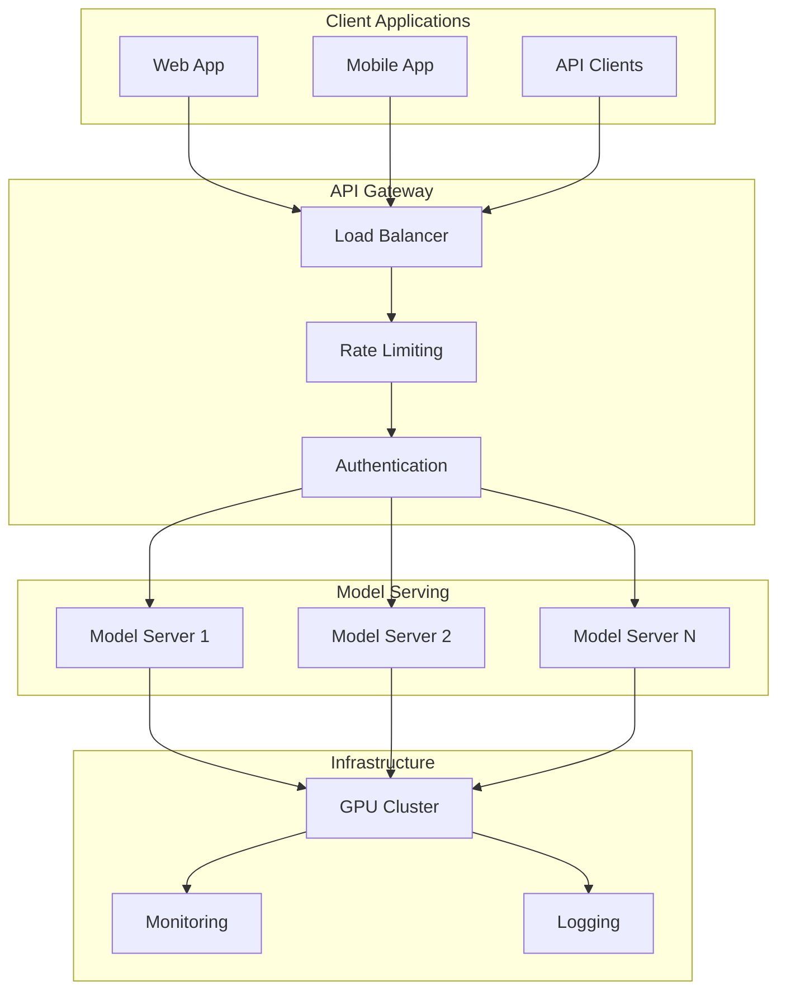

# Chapter 4: Deployment Strategies

## Production LLM Deployment Overview

Deploying Large Language Models in production requires careful consideration of performance, cost, scalability, and reliability. This chapter covers the complete deployment pipeline from model optimization to serving infrastructure.

## Deployment Architecture Options



## Model Optimization for Inference

### Quantization

Reduce model size and memory usage while maintaining performance.

#### Post-Training Quantization

```python
import torch
from transformers import AutoModelForCausalLM, AutoTokenizer

def quantize_model_int8(model_path):
    # Load model in 8-bit precision
    model = AutoModelForCausalLM.from_pretrained(
        model_path,
        device_map="auto",
        load_in_8bit=True,
        torch_dtype=torch.float16
    )
    return model

def quantize_model_int4(model_path):
    # 4-bit quantization with BitsAndBytes
    from transformers import BitsAndBytesConfig

    quantization_config = BitsAndBytesConfig(
        load_in_4bit=True,
        bnb_4bit_quant_type="nf4",
        bnb_4bit_compute_dtype=torch.float16,
        bnb_4bit_use_double_quant=True
    )

    model = AutoModelForCausalLM.from_pretrained(
        model_path,
        quantization_config=quantization_config,
        device_map="auto"
    )
    return model
```

#### Dynamic Quantization

```python
def apply_dynamic_quantization(model):
    # PyTorch dynamic quantization
    quantized_model = torch.quantization.quantize_dynamic(
        model,
        {torch.nn.Linear},
        dtype=torch.qint8
    )
    return quantized_model

# ONNX quantization
def quantize_to_onnx(model_path, output_path):
    from onnxruntime.quantization import quantize_dynamic, QuantType

    quantize_dynamic(
        model_path,
        output_path,
        weight_type=QuantType.QUInt8
    )
```

### Model Pruning

Remove unnecessary parameters to reduce model size.

```python
import torch.nn.utils.prune as prune

def structured_pruning(model, pruning_ratio=0.2):
    for name, module in model.named_modules():
        if isinstance(module, torch.nn.Linear):
            # Prune 20% of weights with lowest magnitude
            prune.l1_unstructured(module, name='weight', amount=pruning_ratio)

    return model

def magnitude_based_pruning(model, sparsity=0.3):
    parameters_to_prune = []

    for name, module in model.named_modules():
        if isinstance(module, torch.nn.Linear):
            parameters_to_prune.append((module, 'weight'))

    # Global magnitude-based pruning
    prune.global_unstructured(
        parameters_to_prune,
        pruning_method=prune.L1Unstructured,
        amount=sparsity
    )

    return model
```

### Knowledge Distillation

Create smaller, faster models that mimic larger ones.

```python
class DistillationTrainer:
    def __init__(self, teacher_model, student_model, temperature=3.0, alpha=0.7):
        self.teacher = teacher_model
        self.student = student_model
        self.temperature = temperature
        self.alpha = alpha  # Weight for distillation loss

    def distillation_loss(self, student_logits, teacher_logits, labels):
        # Soft targets from teacher
        soft_teacher = F.softmax(teacher_logits / self.temperature, dim=-1)
        soft_student = F.log_softmax(student_logits / self.temperature, dim=-1)

        # KL divergence loss
        distillation_loss = F.kl_div(
            soft_student,
            soft_teacher,
            reduction='batchmean'
        ) * (self.temperature ** 2)

        # Standard cross-entropy loss
        ce_loss = F.cross_entropy(student_logits, labels)

        # Combined loss
        total_loss = self.alpha * distillation_loss + (1 - self.alpha) * ce_loss
        return total_loss

    def train_step(self, batch):
        input_ids, labels = batch

        # Teacher predictions (no grad)
        with torch.no_grad():
            teacher_logits = self.teacher(input_ids).logits

        # Student predictions
        student_logits = self.student(input_ids).logits

        # Compute distillation loss
        loss = self.distillation_loss(student_logits, teacher_logits, labels)

        return loss
```

## Serving Frameworks and Platforms

### FastAPI Serving

```python
from fastapi import FastAPI, HTTPException
from pydantic import BaseModel
import torch
from transformers import AutoTokenizer, AutoModelForCausalLM
import asyncio

app = FastAPI()

class GenerationRequest(BaseModel):
    prompt: str
    max_length: int = 100
    temperature: float = 0.7
    top_p: float = 0.9

class ModelServer:
    def __init__(self, model_path: str):
        self.tokenizer = AutoTokenizer.from_pretrained(model_path)
        self.model = AutoModelForCausalLM.from_pretrained(
            model_path,
            torch_dtype=torch.float16,
            device_map="auto"
        )
        self.model.eval()

    async def generate(self, request: GenerationRequest):
        try:
            inputs = self.tokenizer(
                request.prompt,
                return_tensors="pt"
            ).to(self.model.device)

            with torch.no_grad():
                outputs = self.model.generate(
                    **inputs,
                    max_length=request.max_length,
                    temperature=request.temperature,
                    top_p=request.top_p,
                    do_sample=True,
                    pad_token_id=self.tokenizer.eos_token_id
                )

            response = self.tokenizer.decode(
                outputs[0],
                skip_special_tokens=True
            )

            return {"generated_text": response}

        except Exception as e:
            raise HTTPException(status_code=500, detail=str(e))

# Initialize model server
model_server = ModelServer("microsoft/DialoGPT-medium")

@app.post("/generate")
async def generate_text(request: GenerationRequest):
    return await model_server.generate(request)

@app.get("/health")
async def health_check():
    return {"status": "healthy"}
```

### TorchServe Deployment

```python
# model_handler.py
import torch
from transformers import AutoTokenizer, AutoModelForCausalLM
from ts.torch_handler.base_handler import BaseHandler

class LLMHandler(BaseHandler):
    def __init__(self):
        super().__init__()
        self.tokenizer = None
        self.model = None

    def initialize(self, context):
        properties = context.system_properties
        model_dir = properties.get("model_dir")

        # Load model and tokenizer
        self.tokenizer = AutoTokenizer.from_pretrained(model_dir)
        self.model = AutoModelForCausalLM.from_pretrained(
            model_dir,
            torch_dtype=torch.float16
        )
        self.model.eval()

    def preprocess(self, data):
        text = data[0].get("body", {}).get("prompt", "")
        inputs = self.tokenizer(text, return_tensors="pt")
        return inputs

    def inference(self, inputs):
        with torch.no_grad():
            outputs = self.model.generate(
                **inputs,
                max_length=100,
                temperature=0.7,
                do_sample=True
            )
        return outputs

    def postprocess(self, outputs):
        response = self.tokenizer.decode(outputs[0], skip_special_tokens=True)
        return [{"generated_text": response}]
```

### vLLM for High-Performance Serving

```python
from vllm import LLM, SamplingParams

class vLLMServer:
    def __init__(self, model_path: str, tensor_parallel_size: int = 1):
        self.llm = LLM(
            model=model_path,
            tensor_parallel_size=tensor_parallel_size,
            gpu_memory_utilization=0.9,
            max_model_len=2048
        )

    def generate_batch(self, prompts: list, **kwargs):
        sampling_params = SamplingParams(
            temperature=kwargs.get("temperature", 0.7),
            top_p=kwargs.get("top_p", 0.9),
            max_tokens=kwargs.get("max_tokens", 100)
        )

        outputs = self.llm.generate(prompts, sampling_params)

        results = []
        for output in outputs:
            results.append({
                "prompt": output.prompt,
                "generated_text": output.outputs[0].text
            })

        return results

# Usage
server = vLLMServer("meta-llama/Llama-2-7b-chat-hf", tensor_parallel_size=2)
results = server.generate_batch(["Hello, how are you?", "Explain quantum computing"])
```

## Containerization and Orchestration

### Docker Containerization

```dockerfile
# Dockerfile for LLM serving
FROM nvidia/cuda:11.8-devel-ubuntu20.04

# Install Python and dependencies
RUN apt-get update && apt-get install -y python3 python3-pip
COPY requirements.txt .
RUN pip3 install -r requirements.txt

# Copy model and application code
COPY model/ /app/model/
COPY app/ /app/
WORKDIR /app

# Set environment variables
ENV CUDA_VISIBLE_DEVICES=0
ENV MODEL_PATH=/app/model

# Expose port
EXPOSE 8000

# Health check
HEALTHCHECK --interval=30s --timeout=30s --start-period=5s --retries=3 \
    CMD curl -f http://localhost:8000/health || exit 1

# Run application
CMD ["python3", "serve.py"]
```

```yaml
# docker-compose.yml
version: "3.8"
services:
  llm-server:
    build: .
    ports:
      - "8000:8000"
    environment:
      - CUDA_VISIBLE_DEVICES=0
      - MODEL_PATH=/app/model
    volumes:
      - ./model:/app/model:ro
    deploy:
      resources:
        reservations:
          devices:
            - driver: nvidia
              count: 1
              capabilities: [gpu]
    restart: unless-stopped

  nginx:
    image: nginx:alpine
    ports:
      - "80:80"
    volumes:
      - ./nginx.conf:/etc/nginx/nginx.conf:ro
    depends_on:
      - llm-server
```

### Kubernetes Deployment

```yaml
# k8s-deployment.yaml
apiVersion: apps/v1
kind: Deployment
metadata:
  name: llm-deployment
spec:
  replicas: 3
  selector:
    matchLabels:
      app: llm-server
  template:
    metadata:
      labels:
        app: llm-server
    spec:
      containers:
        - name: llm-server
          image: llm-server:latest
          ports:
            - containerPort: 8000
          resources:
            requests:
              nvidia.com/gpu: 1
              memory: "8Gi"
              cpu: "2"
            limits:
              nvidia.com/gpu: 1
              memory: "16Gi"
              cpu: "4"
          env:
            - name: MODEL_PATH
              value: "/app/model"
          livenessProbe:
            httpGet:
              path: /health
              port: 8000
            initialDelaySeconds: 60
            periodSeconds: 30
          readinessProbe:
            httpGet:
              path: /health
              port: 8000
            initialDelaySeconds: 30
            periodSeconds: 10
---
apiVersion: v1
kind: Service
metadata:
  name: llm-service
spec:
  selector:
    app: llm-server
  ports:
    - port: 80
      targetPort: 8000
  type: LoadBalancer
```

## Performance Optimization

### Caching Strategies

```python
import redis
import hashlib
import json

class ResponseCache:
    def __init__(self, redis_host="localhost", redis_port=6379, ttl=3600):
        self.redis_client = redis.Redis(host=redis_host, port=redis_port)
        self.ttl = ttl

    def get_cache_key(self, prompt, params):
        # Create deterministic cache key
        cache_data = {
            "prompt": prompt,
            "params": sorted(params.items())
        }
        cache_string = json.dumps(cache_data, sort_keys=True)
        return hashlib.md5(cache_string.encode()).hexdigest()

    def get(self, prompt, params):
        cache_key = self.get_cache_key(prompt, params)
        cached_response = self.redis_client.get(cache_key)

        if cached_response:
            return json.loads(cached_response)
        return None

    def set(self, prompt, params, response):
        cache_key = self.get_cache_key(prompt, params)
        self.redis_client.setex(
            cache_key,
            self.ttl,
            json.dumps(response)
        )

# Usage in API endpoint
cache = ResponseCache()

@app.post("/generate")
async def generate_with_cache(request: GenerationRequest):
    # Check cache first
    params = {
        "max_length": request.max_length,
        "temperature": request.temperature,
        "top_p": request.top_p
    }

    cached_response = cache.get(request.prompt, params)
    if cached_response:
        return cached_response

    # Generate new response
    response = await model_server.generate(request)

    # Cache the response
    cache.set(request.prompt, params, response)

    return response
```

### Batching and Queue Management

```python
import asyncio
from collections import deque
import time

class BatchProcessor:
    def __init__(self, model, batch_size=8, max_wait_time=0.1):
        self.model = model
        self.batch_size = batch_size
        self.max_wait_time = max_wait_time
        self.request_queue = deque()
        self.processing = False

    async def add_request(self, request):
        future = asyncio.Future()
        self.request_queue.append((request, future, time.time()))

        if not self.processing:
            asyncio.create_task(self.process_batch())

        return await future

    async def process_batch(self):
        self.processing = True

        while self.request_queue:
            batch = []
            futures = []
            start_time = time.time()

            # Collect batch
            while (len(batch) < self.batch_size and
                   self.request_queue and
                   (time.time() - start_time) < self.max_wait_time):

                if self.request_queue:
                    req, future, req_time = self.request_queue.popleft()
                    batch.append(req)
                    futures.append(future)

                if not self.request_queue:
                    await asyncio.sleep(0.01)  # Brief wait for more requests

            if batch:
                # Process batch
                try:
                    results = await self.process_batch_requests(batch)

                    # Return results to futures
                    for future, result in zip(futures, results):
                        future.set_result(result)

                except Exception as e:
                    # Handle errors
                    for future in futures:
                        future.set_exception(e)

        self.processing = False

    async def process_batch_requests(self, requests):
        prompts = [req.prompt for req in requests]

        # Batch inference
        inputs = self.model.tokenizer(
            prompts,
            return_tensors="pt",
            padding=True,
            truncation=True
        )

        with torch.no_grad():
            outputs = self.model.generate(**inputs, max_length=100)

        # Decode results
        results = []
        for i, output in enumerate(outputs):
            text = self.model.tokenizer.decode(output, skip_special_tokens=True)
            results.append({"generated_text": text})

        return results
```

### Load Balancing

```python
# nginx.conf for load balancing
upstream llm_backend {
    least_conn;
    server llm-server-1:8000 weight=1 max_fails=3 fail_timeout=30s;
    server llm-server-2:8000 weight=1 max_fails=3 fail_timeout=30s;
    server llm-server-3:8000 weight=1 max_fails=3 fail_timeout=30s;
}

server {
    listen 80;

    location / {
        proxy_pass http://llm_backend;
        proxy_set_header Host $host;
        proxy_set_header X-Real-IP $remote_addr;
        proxy_set_header X-Forwarded-For $proxy_add_x_forwarded_for;

        # Timeouts
        proxy_connect_timeout 30s;
        proxy_send_timeout 30s;
        proxy_read_timeout 120s;

        # Buffer settings
        proxy_buffering on;
        proxy_buffer_size 4k;
        proxy_buffers 8 4k;
    }

    location /health {
        access_log off;
        proxy_pass http://llm_backend/health;
    }
}
```

## Monitoring and Observability

### Metrics Collection

```python
import time
import psutil
import GPUtil
from prometheus_client import Counter, Histogram, Gauge, start_http_server

# Metrics
REQUEST_COUNT = Counter('llm_requests_total', 'Total requests', ['status'])
REQUEST_DURATION = Histogram('llm_request_duration_seconds', 'Request duration')
ACTIVE_CONNECTIONS = Gauge('llm_active_connections', 'Active connections')
GPU_UTILIZATION = Gauge('llm_gpu_utilization_percent', 'GPU utilization')
MEMORY_USAGE = Gauge('llm_memory_usage_bytes', 'Memory usage')

class MetricsCollector:
    def __init__(self):
        # Start Prometheus metrics server
        start_http_server(9090)

    def record_request(self, status="success", duration=0):
        REQUEST_COUNT.labels(status=status).inc()
        REQUEST_DURATION.observe(duration)

    def update_system_metrics(self):
        # GPU metrics
        gpus = GPUtil.getGPUs()
        if gpus:
            GPU_UTILIZATION.set(gpus[0].load * 100)

        # Memory metrics
        memory = psutil.virtual_memory()
        MEMORY_USAGE.set(memory.used)

    def middleware(self, request, call_next):
        start_time = time.time()
        ACTIVE_CONNECTIONS.inc()

        try:
            response = call_next(request)
            self.record_request("success", time.time() - start_time)
            return response
        except Exception as e:
            self.record_request("error", time.time() - start_time)
            raise
        finally:
            ACTIVE_CONNECTIONS.dec()

# Usage with FastAPI
metrics = MetricsCollector()
app.middleware("http")(metrics.middleware)
```

### Distributed Tracing

```python
from opentelemetry import trace
from opentelemetry.exporter.jaeger.thrift import JaegerExporter
from opentelemetry.sdk.trace import TracerProvider
from opentelemetry.sdk.trace.export import BatchSpanProcessor

# Setup tracing
trace.set_tracer_provider(TracerProvider())
tracer = trace.get_tracer(__name__)

jaeger_exporter = JaegerExporter(
    agent_host_name="jaeger",
    agent_port=6831,
)

span_processor = BatchSpanProcessor(jaeger_exporter)
trace.get_tracer_provider().add_span_processor(span_processor)

class TracedModelServer:
    def __init__(self, model_path):
        self.model_server = ModelServer(model_path)

    async def generate(self, request):
        with tracer.start_as_current_span("llm_generation") as span:
            span.set_attribute("prompt_length", len(request.prompt))
            span.set_attribute("max_length", request.max_length)
            span.set_attribute("temperature", request.temperature)

            try:
                start_time = time.time()
                result = await self.model_server.generate(request)

                duration = time.time() - start_time
                span.set_attribute("generation_duration", duration)
                span.set_attribute("output_length", len(result["generated_text"]))
                span.set_status(trace.Status(trace.StatusCode.OK))

                return result

            except Exception as e:
                span.set_status(trace.Status(trace.StatusCode.ERROR, str(e)))
                raise
```

## Cost Optimization

### Auto-scaling Configuration

```python
# Kubernetes HPA configuration
apiVersion: autoscaling/v2
kind: HorizontalPodAutoscaler
metadata:
  name: llm-hpa
spec:
  scaleTargetRef:
    apiVersion: apps/v1
    kind: Deployment
    name: llm-deployment
  minReplicas: 1
  maxReplicas: 10
  metrics:
  - type: Resource
    resource:
      name: cpu
      target:
        type: Utilization
        averageUtilization: 70
  - type: Resource
    resource:
      name: memory
      target:
        type: Utilization
        averageUtilization: 80
  behavior:
    scaleUp:
      stabilizationWindowSeconds: 300
      policies:
      - type: Percent
        value: 100
        periodSeconds: 15
    scaleDown:
      stabilizationWindowSeconds: 300
      policies:
      - type: Percent
        value: 10
        periodSeconds: 60
```

### Spot Instance Management

```python
import boto3

class SpotInstanceManager:
    def __init__(self):
        self.ec2 = boto3.client('ec2')
        self.ecs = boto3.client('ecs')

    def request_spot_instances(self, instance_count=1):
        response = self.ec2.request_spot_instances(
            SpotPrice='0.50',
            InstanceCount=instance_count,
            Type='one-time',
            LaunchSpecification={
                'ImageId': 'ami-12345678',  # LLM-ready AMI
                'InstanceType': 'g4dn.xlarge',
                'KeyName': 'my-key-pair',
                'SecurityGroups': ['llm-security-group'],
                'UserData': self.get_user_data()
            }
        )
        return response

    def get_user_data(self):
        return """#!/bin/bash
        docker pull my-llm-server:latest
        docker run -d --gpus all -p 8000:8000 my-llm-server:latest
        """

    def monitor_spot_interruption(self):
        # Check for spot interruption notice
        try:
            response = requests.get(
                'http://169.254.169.254/latest/meta-data/spot/instance-action',
                timeout=2
            )
            if response.status_code == 200:
                # Gracefully handle interruption
                self.graceful_shutdown()
        except requests.RequestException:
            pass  # No interruption notice

    def graceful_shutdown(self):
        # Drain connections and shutdown
        print("Spot interruption detected. Gracefully shutting down...")
        # Implementation depends on your serving framework
```

## Security Considerations

### Authentication and Authorization

```python
from fastapi import Depends, HTTPException, status
from fastapi.security import HTTPBearer, HTTPAuthorizationCredentials
import jwt

security = HTTPBearer()

def verify_token(credentials: HTTPAuthorizationCredentials = Depends(security)):
    try:
        payload = jwt.decode(
            credentials.credentials,
            SECRET_KEY,
            algorithms=["HS256"]
        )
        username = payload.get("sub")
        if username is None:
            raise HTTPException(status_code=401, detail="Invalid token")
        return username
    except jwt.PyJWTError:
        raise HTTPException(status_code=401, detail="Invalid token")

@app.post("/generate")
async def generate_text(
    request: GenerationRequest,
    current_user: str = Depends(verify_token)
):
    # Log request for audit
    logger.info(f"User {current_user} requested generation: {request.prompt[:50]}...")

    return await model_server.generate(request)
```

### Input Validation and Sanitization

```python
from pydantic import BaseModel, validator
import re

class SecureGenerationRequest(BaseModel):
    prompt: str
    max_length: int = 100
    temperature: float = 0.7

    @validator('prompt')
    def validate_prompt(cls, v):
        # Length limits
        if len(v) > 1000:
            raise ValueError('Prompt too long')
        if len(v.strip()) == 0:
            raise ValueError('Prompt cannot be empty')

        # Content filtering
        forbidden_patterns = [
            r'<script.*?>',  # Potential XSS
            r'javascript:',  # JavaScript injection
            r'data:.*base64',  # Data URLs
        ]

        for pattern in forbidden_patterns:
            if re.search(pattern, v, re.IGNORECASE):
                raise ValueError('Invalid content detected')

        return v.strip()

    @validator('max_length')
    def validate_max_length(cls, v):
        if v < 1 or v > 500:
            raise ValueError('max_length must be between 1 and 500')
        return v

    @validator('temperature')
    def validate_temperature(cls, v):
        if v < 0.0 or v > 2.0:
            raise ValueError('temperature must be between 0.0 and 2.0')
        return v
```

## Key Takeaways

- **Model optimization** through quantization and pruning reduces resource requirements
- **Serving frameworks** like vLLM and TorchServe provide production-ready inference
- **Containerization** enables consistent deployment across environments
- **Caching and batching** significantly improve throughput and reduce costs
- **Monitoring** is essential for maintaining reliability and performance
- **Auto-scaling** helps balance cost and availability
- **Security** considerations are crucial for production deployments

## Next Steps

Chapter 5 will cover **performance optimization** techniques including advanced inference methods, hardware acceleration, and efficiency improvements.

---

## Navigation

- [← Chapter 3: Training & Fine-tuning](./training)
- [Chapter 5: Performance Optimization →](./optimization)
