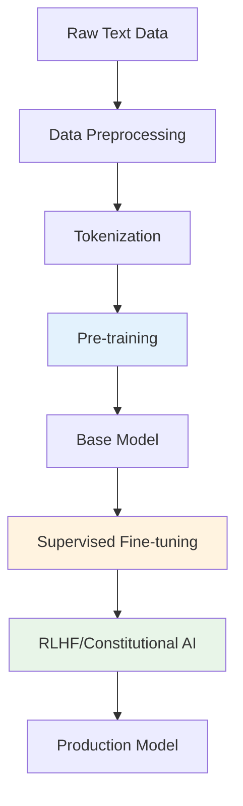
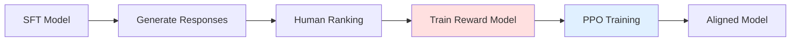

# Chapter 3: Training & Fine-tuning

## Overview of LLM Training

Training Large Language Models is a complex, multi-stage process that transforms raw neural networks into sophisticated language understanding systems. This chapter covers the complete training pipeline from data preparation to deployment.

## Training Pipeline Overview



## Phase 1: Pre-training

### Objectives and Data

**Primary Objective**: Next token prediction (autoregressive language modeling)

```python
def compute_loss(model, input_ids, labels):
    # Shift labels for causal LM
    shift_labels = labels[..., 1:].contiguous()
    shift_logits = model(input_ids)[..., :-1, :].contiguous()

    # Cross-entropy loss
    loss = F.cross_entropy(
        shift_logits.view(-1, shift_logits.size(-1)),
        shift_labels.view(-1)
    )
    return loss
```

### Training Data Sources

1. **Web Crawls**: Common Crawl, WebText
2. **Books**: BookCorpus, Project Gutenberg
3. **Academic**: ArXiv, PubMed papers
4. **Code**: GitHub repositories
5. **Reference**: Wikipedia, Wikibooks

### Data Quality Considerations

```python
class DataFilter:
    def __init__(self):
        self.min_length = 50
        self.max_length = 100000
        self.language_detector = fasttext.load_model('lid.176.bin')

    def filter_document(self, text):
        # Length filtering
        if len(text) < self.min_length or len(text) > self.max_length:
            return False

        # Language detection
        lang, confidence = self.language_detector.predict(text)
        if lang != '__label__en' or confidence < 0.9:
            return False

        # Quality metrics
        if self.calculate_perplexity(text) > threshold:
            return False

        return True
```

### Training Configuration

**Typical GPT-style Training Setup**:

```python
training_config = {
    "model_size": "6.7B",
    "sequence_length": 2048,
    "batch_size": 1024,
    "learning_rate": 1e-4,
    "warmup_steps": 2000,
    "total_steps": 300000,
    "gradient_clipping": 1.0,
    "weight_decay": 0.1,
    "optimizer": "AdamW",
    "lr_schedule": "cosine_with_warmup"
}
```

### Optimization Techniques

#### Learning Rate Scheduling

```python
def get_cosine_schedule_with_warmup(optimizer, num_warmup_steps, num_training_steps):
    def lr_lambda(current_step):
        if current_step < num_warmup_steps:
            return float(current_step) / float(max(1, num_warmup_steps))

        progress = float(current_step - num_warmup_steps) / float(max(1, num_training_steps - num_warmup_steps))
        return max(0.0, 0.5 * (1.0 + math.cos(math.pi * progress)))

    return LambdaLR(optimizer, lr_lambda)
```

#### Gradient Accumulation

```python
def training_step(model, batch, accumulation_steps):
    total_loss = 0

    for i in range(accumulation_steps):
        micro_batch = get_micro_batch(batch, i, accumulation_steps)

        with model.no_sync() if i < accumulation_steps - 1 else nullcontext():
            loss = compute_loss(model, micro_batch)
            loss = loss / accumulation_steps  # Scale loss
            loss.backward()

        total_loss += loss.item()

    torch.nn.utils.clip_grad_norm_(model.parameters(), max_norm=1.0)
    optimizer.step()
    optimizer.zero_grad()

    return total_loss
```

## Phase 2: Supervised Fine-tuning (SFT)

### Instruction Following

Convert base models to follow instructions through supervised learning on instruction-response pairs.

```python
# Example instruction-response pair
instruction_data = {
    "instruction": "Explain the concept of machine learning in simple terms.",
    "input": "",
    "output": "Machine learning is a way for computers to learn patterns..."
}

def format_instruction(example):
    if example["input"]:
        return f"### Instruction:\n{example['instruction']}\n\n### Input:\n{example['input']}\n\n### Response:\n{example['output']}"
    else:
        return f"### Instruction:\n{example['instruction']}\n\n### Response:\n{example['output']}"
```

### Dataset Curation

Popular instruction datasets:

- **Alpaca**: 52K instruction-following examples
- **Vicuna**: ShareGPT conversations
- **OpenAssistant**: Human-generated conversations
- **Dolly**: Human-generated instruction pairs

### Training Process

```python
def sft_training_loop(model, instruction_dataset, epochs=3):
    model.train()

    for epoch in range(epochs):
        for batch in instruction_dataset:
            # Format instructions
            inputs = tokenizer(
                [format_instruction(ex) for ex in batch],
                padding=True,
                truncation=True,
                return_tensors="pt"
            )

            # Compute loss only on response tokens
            labels = inputs["input_ids"].clone()
            labels = mask_instruction_tokens(labels, batch)

            loss = model(**inputs, labels=labels).loss
            loss.backward()

            optimizer.step()
            optimizer.zero_grad()
```

## Phase 3: Reinforcement Learning from Human Feedback (RLHF)

### Process Overview



### Step 1: Reward Model Training

```python
class RewardModel(nn.Module):
    def __init__(self, base_model):
        super().__init__()
        self.transformer = base_model.transformer
        self.reward_head = nn.Linear(base_model.config.hidden_size, 1)

    def forward(self, input_ids):
        hidden_states = self.transformer(input_ids).last_hidden_state
        # Use last token for reward prediction
        reward = self.reward_head(hidden_states[:, -1, :])
        return reward

def train_reward_model(model, comparison_data):
    for batch in comparison_data:
        # batch contains chosen and rejected responses
        chosen_rewards = model(batch["chosen_input_ids"])
        rejected_rewards = model(batch["rejected_input_ids"])

        # Preference loss
        loss = -torch.log(torch.sigmoid(chosen_rewards - rejected_rewards))
        loss = loss.mean()

        loss.backward()
        optimizer.step()
        optimizer.zero_grad()
```

### Step 2: PPO Training

```python
def ppo_training_step(policy_model, reward_model, ref_model, prompts):
    # Generate responses
    with torch.no_grad():
        responses = policy_model.generate(prompts, max_length=512)
        old_log_probs = policy_model.get_log_probs(prompts, responses)
        rewards = reward_model(torch.cat([prompts, responses], dim=1))

    # Compute advantages
    advantages = compute_advantages(rewards)

    # PPO update
    for _ in range(ppo_epochs):
        new_log_probs = policy_model.get_log_probs(prompts, responses)
        ratio = torch.exp(new_log_probs - old_log_probs)

        # Clipped objective
        clipped_ratio = torch.clamp(ratio, 1 - clip_eps, 1 + clip_eps)
        policy_loss = -torch.min(ratio * advantages, clipped_ratio * advantages).mean()

        # KL penalty to prevent deviation from reference model
        ref_log_probs = ref_model.get_log_probs(prompts, responses)
        kl_penalty = kl_coeff * (new_log_probs - ref_log_probs).mean()

        total_loss = policy_loss + kl_penalty
        total_loss.backward()

        optimizer.step()
        optimizer.zero_grad()
```

## Phase 4: Advanced Fine-tuning Techniques

### Parameter-Efficient Fine-tuning

#### LoRA (Low-Rank Adaptation)

```python
class LoRALinear(nn.Module):
    def __init__(self, original_linear, rank=16):
        super().__init__()
        self.original = original_linear
        self.rank = rank

        # Low-rank matrices
        self.lora_A = nn.Linear(original_linear.in_features, rank, bias=False)
        self.lora_B = nn.Linear(rank, original_linear.out_features, bias=False)
        self.alpha = 16  # Scaling factor

        # Initialize LoRA weights
        nn.init.kaiming_uniform_(self.lora_A.weight)
        nn.init.zeros_(self.lora_B.weight)

    def forward(self, x):
        original_output = self.original(x)
        lora_output = self.lora_B(self.lora_A(x)) * (self.alpha / self.rank)
        return original_output + lora_output
```

#### QLoRA (Quantized LoRA)

```python
def apply_qlora(model, rank=16):
    # Quantize base model to 4-bit
    model = BitsAndBytesConfig(
        load_in_4bit=True,
        bnb_4bit_quant_type="nf4",
        bnb_4bit_compute_dtype=torch.float16
    )

    # Apply LoRA to attention layers
    for name, module in model.named_modules():
        if "self_attn" in name and isinstance(module, nn.Linear):
            setattr(model, name, LoRALinear(module, rank))

    return model
```

### Domain-Specific Fine-tuning

#### Code Generation

```python
# Code instruction format
code_instruction = {
    "instruction": "Write a Python function to calculate fibonacci numbers",
    "input": "def fibonacci(n):",
    "output": """def fibonacci(n):
    if n <= 1:
        return n
    return fibonacci(n-1) + fibonacci(n-2)"""
}

def train_code_model(model, code_dataset):
    # Special tokenization for code
    tokenizer.add_special_tokens({
        "additional_special_tokens": ["<|code|>", "<|/code|>", "<|comment|>", "<|/comment|>"]
    })

    # Code-specific loss weighting
    for batch in code_dataset:
        loss = compute_loss_with_syntax_weighting(model, batch)
        loss.backward()
        optimizer.step()
```

#### Scientific/Medical Domains

```python
def create_domain_dataset(domain="medical"):
    # Domain-specific data sources
    if domain == "medical":
        sources = [
            "PubMed abstracts",
            "Medical textbooks",
            "Clinical notes (anonymized)",
            "Drug databases"
        ]

    # Domain-specific evaluation
    evaluation_tasks = [
        "medical_qa",
        "drug_interaction",
        "diagnosis_assistance",
        "literature_summarization"
    ]

    return sources, evaluation_tasks
```

## Training Infrastructure and Scaling

### Distributed Training

```python
def setup_distributed_training():
    # Initialize process group
    dist.init_process_group(backend='nccl')

    # Wrap model for distributed training
    model = DistributedDataParallel(model, device_ids=[local_rank])

    # Distributed sampler
    sampler = DistributedSampler(dataset)
    dataloader = DataLoader(dataset, sampler=sampler)

    return model, dataloader

# Model parallelism for large models
def apply_model_parallelism(model, num_gpus):
    layers_per_gpu = len(model.layers) // num_gpus

    for i, layer in enumerate(model.layers):
        device_id = i // layers_per_gpu
        layer.to(f'cuda:{device_id}')

    return model
```

### Memory Optimization

```python
# Gradient checkpointing
def enable_gradient_checkpointing(model):
    model.gradient_checkpointing_enable()

    # Custom checkpointing for transformer blocks
    for layer in model.transformer.layers:
        layer = checkpoint(layer)

# DeepSpeed integration
def setup_deepspeed(model, config):
    model_engine, optimizer, _, _ = deepspeed.initialize(
        model=model,
        config_params=config
    )
    return model_engine
```

## Evaluation and Monitoring

### Training Metrics

```python
def log_training_metrics(step, loss, learning_rate, grad_norm):
    wandb.log({
        "train/loss": loss,
        "train/learning_rate": learning_rate,
        "train/grad_norm": grad_norm,
        "train/step": step
    })

def evaluate_model(model, eval_dataset):
    model.eval()
    total_loss = 0

    with torch.no_grad():
        for batch in eval_dataset:
            loss = compute_loss(model, batch)
            total_loss += loss.item()

    perplexity = math.exp(total_loss / len(eval_dataset))
    return {"eval_loss": total_loss, "perplexity": perplexity}
```

### Downstream Task Evaluation

```python
# Standard benchmarks
evaluation_benchmarks = {
    "language_modeling": ["WikiText-103", "Penn Treebank"],
    "reading_comprehension": ["SQuAD", "Natural Questions"],
    "common_sense": ["HellaSwag", "PIQA", "WinoGrande"],
    "math_reasoning": ["GSM8K", "MATH"],
    "code_generation": ["HumanEval", "MBPP"]
}

def run_benchmark_evaluation(model, benchmark_name):
    dataset = load_benchmark(benchmark_name)

    results = []
    for example in dataset:
        prediction = model.generate(example["input"])
        score = evaluate_prediction(prediction, example["expected"])
        results.append(score)

    return {"accuracy": np.mean(results), "std": np.std(results)}
```

## Best Practices and Common Pitfalls

### Training Stability

```python
# Gradient clipping
def clip_gradients(model, max_norm=1.0):
    torch.nn.utils.clip_grad_norm_(model.parameters(), max_norm)

# Loss scaling for mixed precision
def mixed_precision_training():
    scaler = GradScaler()

    with autocast():
        loss = compute_loss(model, batch)

    scaler.scale(loss).backward()
    scaler.unscale_(optimizer)
    clip_gradients(model)
    scaler.step(optimizer)
    scaler.update()
```

### Hyperparameter Selection

| Parameter     | Small Models | Large Models | Notes                      |
| ------------- | ------------ | ------------ | -------------------------- |
| Learning Rate | 1e-4 to 5e-4 | 1e-5 to 1e-4 | Scale down with model size |
| Batch Size    | 128-512      | 1024-4096    | Limited by memory          |
| Warmup Steps  | 500-2000     | 2000-10000   | ~1-3% of total steps       |
| Weight Decay  | 0.01-0.1     | 0.1-0.3      | Prevents overfitting       |

### Common Issues and Solutions

1. **Training Instability**

   - Use gradient clipping
   - Reduce learning rate
   - Check for NaN values

2. **Memory Issues**

   - Enable gradient checkpointing
   - Use smaller batch sizes with accumulation
   - Apply model parallelism

3. **Slow Convergence**
   - Increase batch size
   - Tune learning rate schedule
   - Check data quality

## Key Takeaways

- **Pre-training** establishes language understanding through next-token prediction
- **Fine-tuning** adapts models to specific tasks and behaviors
- **RLHF** aligns models with human preferences and values
- **Parameter-efficient methods** like LoRA enable cost-effective adaptation
- **Infrastructure choices** significantly impact training efficiency
- **Evaluation** should cover both perplexity and downstream task performance

## Next Steps

Chapter 4 will cover **deployment strategies** for LLMs, including inference optimization, serving architectures, and production considerations.

---

## Navigation

- [← Chapter 2: Model Architecture](./architecture)
- [Chapter 4: Deployment Strategies →](./deployment)
