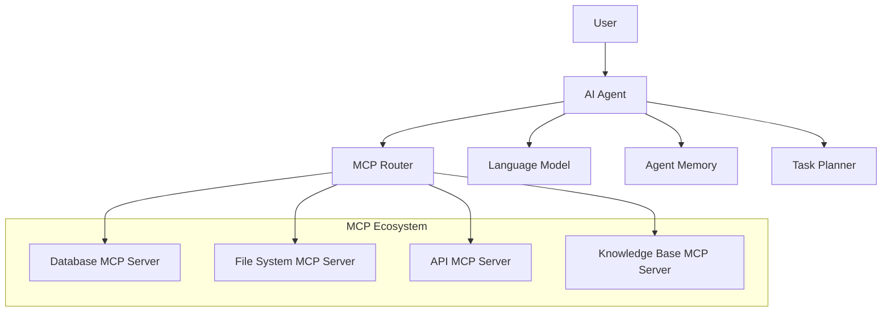

# Chapter 4: Agent Integration

## Integrating MCP with AI Agents and Frameworks

This chapter explores how to integrate MCP servers with popular AI agent frameworks and build sophisticated multi-agent workflows. We'll cover integration patterns, best practices, and real-world examples of MCP-powered AI agents.

## Understanding Agent-MCP Architecture

### The Agent-MCP Ecosystem



### Core Integration Patterns

1. **Direct Integration**: Agent directly communicates with MCP servers
2. **Router Pattern**: Centralized MCP router manages multiple servers
3. **Plugin Architecture**: MCP servers as dynamically loaded plugins
4. **Service Mesh**: Distributed MCP servers in microservices architecture

## LangChain Integration

### Setting Up LangChain with MCP

```typescript
// agents/langchain-mcp-agent.ts
import { ChatOpenAI } from "@langchain/openai";
import { AgentExecutor, createToolCallingAgent } from "langchain/agents";
import { ChatPromptTemplate } from "@langchain/core/prompts";
import { Tool } from "@langchain/core/tools";
import { MCPClient } from "../mcp/client.js";
import { MCPToolWrapper } from "./mcp-tool-wrapper.js";

export class LangChainMCPAgent {
  private llm: ChatOpenAI;
  private mcpClients: Map<string, MCPClient>;
  private tools: Tool[];
  private agent: AgentExecutor;

  constructor(config: {
    openaiApiKey: string;
    mcpServers: Array<{
      name: string;
      command: string;
      args?: string[];
    }>;
  }) {
    this.llm = new ChatOpenAI({
      openAIApiKey: config.openaiApiKey,
      modelName: "gpt-4-turbo",
      temperature: 0,
    });

    this.mcpClients = new Map();
    this.tools = [];

    this.initializeMCPClients(config.mcpServers);
  }

  private async initializeMCPClients(
    servers: Array<{ name: string; command: string; args?: string[] }>
  ): Promise<void> {
    for (const server of servers) {
      const client = new MCPClient(server.command, server.args);
      await client.connect();

      this.mcpClients.set(server.name, client);

      // Convert MCP tools to LangChain tools
      const mcpTools = await client.listTools();
      for (const mcpTool of mcpTools) {
        const langchainTool = new MCPToolWrapper(client, mcpTool, server.name);
        this.tools.push(langchainTool);
      }
    }
  }

  async createAgent(): Promise<void> {
    const prompt = ChatPromptTemplate.fromMessages([
      [
        "system",
        `You are a helpful AI assistant with access to various tools through MCP (Model Context Protocol).
      
      Available MCP servers: ${Array.from(this.mcpClients.keys()).join(", ")}
      
      You can:
      - Query databases and retrieve structured data
      - Search and manipulate files
      - Make HTTP requests to APIs
      - Analyze code and documents
      - Access knowledge bases and documentation
      
      Always explain what you're doing and why you're using specific tools.
      Be thorough in your analysis and provide detailed, helpful responses.`,
      ],
      ["human", "{input}"],
      ["placeholder", "{agent_scratchpad}"],
    ]);

    const agent = await createToolCallingAgent({
      llm: this.llm,
      tools: this.tools,
      prompt,
    });

    this.agent = new AgentExecutor({
      agent,
      tools: this.tools,
      verbose: true,
      maxIterations: 10,
      returnIntermediateSteps: true,
    });
  }

  async execute(input: string): Promise<{
    output: string;
    intermediateSteps: any[];
  }> {
    if (!this.agent) {
      await this.createAgent();
    }

    try {
      const result = await this.agent.invoke({
        input,
      });

      return {
        output: result.output,
        intermediateSteps: result.intermediateSteps || [],
      };
    } catch (error) {
      console.error("Agent execution failed:", error);
      throw error;
    }
  }

  async cleanup(): Promise<void> {
    for (const client of this.mcpClients.values()) {
      await client.disconnect();
    }
    this.mcpClients.clear();
  }
}
```

### MCP Tool Wrapper for LangChain

```typescript
// agents/mcp-tool-wrapper.ts
import { Tool } from "@langchain/core/tools";
import { z } from "zod";
import { MCPClient } from "../mcp/client.js";

export class MCPToolWrapper extends Tool {
  name: string;
  description: string;
  schema: z.ZodSchema<any>;

  constructor(
    private mcpClient: MCPClient,
    private mcpTool: any,
    private serverName: string
  ) {
    super();

    this.name = `${serverName}_${mcpTool.name}`;
    this.description = `[${serverName}] ${mcpTool.description}`;

    // Convert JSON schema to Zod schema
    this.schema = this.convertJsonSchemaToZod(mcpTool.inputSchema);
  }

  async _call(args: any): Promise<string> {
    try {
      const result = await this.mcpClient.callTool(this.mcpTool.name, args);

      // Format the result for LangChain
      if (result.content) {
        return result.content
          .map((content: any) => {
            if (content.type === "text") {
              return content.text;
            } else if (content.type === "image") {
              return `[Image: ${content.data.substring(0, 100)}...]`;
            }
            return JSON.stringify(content);
          })
          .join("\n");
      }

      return JSON.stringify(result);
    } catch (error) {
      return `Error executing tool ${this.mcpTool.name}: ${error.message}`;
    }
  }

  private convertJsonSchemaToZod(jsonSchema: any): z.ZodSchema<any> {
    // Simple JSON Schema to Zod conversion
    // In production, use a proper conversion library
    const properties = jsonSchema.properties || {};
    const required = jsonSchema.required || [];

    const zodObject: Record<string, z.ZodTypeAny> = {};

    for (const [key, prop] of Object.entries(properties)) {
      const propSchema = prop as any;

      let zodType: z.ZodTypeAny;

      switch (propSchema.type) {
        case "string":
          zodType = z.string();
          if (propSchema.enum) {
            zodType = z.enum(propSchema.enum);
          }
          break;
        case "number":
          zodType = z.number();
          break;
        case "boolean":
          zodType = z.boolean();
          break;
        case "array":
          zodType = z.array(z.any());
          break;
        case "object":
          zodType = z.object({});
          break;
        default:
          zodType = z.any();
      }

      if (propSchema.description) {
        zodType = zodType.describe(propSchema.description);
      }

      if (!required.includes(key)) {
        zodType = zodType.optional();
      }

      zodObject[key] = zodType;
    }

    return z.object(zodObject);
  }
}
```

### Example LangChain MCP Usage

```typescript
// examples/langchain-example.ts
import { LangChainMCPAgent } from "../agents/langchain-mcp-agent.js";

async function runLangChainExample() {
  const agent = new LangChainMCPAgent({
    openaiApiKey: process.env.OPENAI_API_KEY!,
    mcpServers: [
      {
        name: "filesystem",
        command: "node",
        args: ["dist/servers/filesystem-server.js"],
      },
      {
        name: "database",
        command: "node",
        args: ["dist/servers/database-server.js"],
      },
      {
        name: "web-api",
        command: "node",
        args: ["dist/servers/api-server.js"],
      },
    ],
  });

  try {
    // Complex multi-step task
    const result = await agent.execute(`
      I need to analyze our customer database and create a comprehensive report.
      
      1. First, query the database to get customer statistics for the last quarter
      2. Then search for any related documentation files
      3. Finally, fetch the latest market data from our API
      4. Combine all this information into a structured analysis
    `);

    console.log("Agent Output:", result.output);
    console.log("\nIntermediate Steps:");
    result.intermediateSteps.forEach((step, i) => {
      console.log(`${i + 1}. ${step.action.tool}: ${step.action.toolInput}`);
      console.log(`   Result: ${step.observation.substring(0, 200)}...`);
    });
  } finally {
    await agent.cleanup();
  }
}

runLangChainExample().catch(console.error);
```

## AutoGen Integration

### Multi-Agent MCP System with AutoGen

```python
# agents/autogen_mcp_system.py
from typing import Dict, List, Any, Optional
import asyncio
import json
from autogen import AssistantAgent, UserProxyAgent, GroupChat, GroupChatManager
from mcp_client import MCPClient

class MCPTool:
    def __init__(self, client: MCPClient, tool_info: Dict[str, Any], server_name: str):
        self.client = client
        self.tool_info = tool_info
        self.server_name = server_name
        self.name = f"{server_name}_{tool_info['name']}"
        self.description = tool_info.get('description', '')

    async def execute(self, **kwargs) -> str:
        try:
            result = await self.client.call_tool(
                self.tool_info['name'],
                kwargs
            )

            if result.get('content'):
                return '\n'.join([
                    content.get('text', str(content))
                    for content in result['content']
                ])

            return json.dumps(result, indent=2)

        except Exception as e:
            return f"Error executing {self.name}: {str(e)}"

class MCPEnabledAgent(AssistantAgent):
    def __init__(
        self,
        name: str,
        llm_config: Dict[str, Any],
        mcp_servers: List[Dict[str, Any]],
        **kwargs
    ):
        super().__init__(name=name, llm_config=llm_config, **kwargs)
        self.mcp_clients: Dict[str, MCPClient] = {}
        self.mcp_tools: Dict[str, MCPTool] = {}

        asyncio.create_task(self._initialize_mcp_servers(mcp_servers))

    async def _initialize_mcp_servers(self, servers: List[Dict[str, Any]]):
        for server_config in servers:
            client = MCPClient(
                command=server_config['command'],
                args=server_config.get('args', [])
            )

            await client.connect()
            self.mcp_clients[server_config['name']] = client

            # Register tools
            tools = await client.list_tools()
            for tool_info in tools:
                tool = MCPTool(client, tool_info, server_config['name'])
                self.mcp_tools[tool.name] = tool

    async def execute_mcp_tool(self, tool_name: str, **kwargs) -> str:
        if tool_name not in self.mcp_tools:
            return f"Tool {tool_name} not found. Available tools: {list(self.mcp_tools.keys())}"

        return await self.mcp_tools[tool_name].execute(**kwargs)

    def get_available_tools(self) -> Dict[str, str]:
        return {
            name: tool.description
            for name, tool in self.mcp_tools.items()
        }

class AutoGenMCPOrchestrator:
    def __init__(self, openai_config: Dict[str, Any]):
        self.openai_config = openai_config
        self.agents: List[MCPEnabledAgent] = []
        self.user_proxy = None
        self.group_chat = None
        self.manager = None

    def create_specialized_agents(self):
        # Database Specialist Agent
        database_agent = MCPEnabledAgent(
            name="DatabaseAnalyst",
            llm_config=self.openai_config,
            system_message="""You are a database analyst specialist. Your role is to:
            - Query databases efficiently and accurately
            - Analyze data patterns and relationships
            - Generate insights from structured data
            - Provide data summaries and statistics

            You have access to database MCP tools. Always use proper SQL practices and explain your queries.""",
            mcp_servers=[
                {
                    'name': 'database',
                    'command': 'node',
                    'args': ['dist/servers/database-server.js']
                }
            ]
        )

        # File System Specialist Agent
        filesystem_agent = MCPEnabledAgent(
            name="FileSystemExpert",
            llm_config=self.openai_config,
            system_message="""You are a file system specialist. Your role is to:
            - Search, read, and analyze files
            - Organize and manage file structures
            - Extract information from documents
            - Handle various file formats

            You have access to filesystem MCP tools. Always respect file permissions and security.""",
            mcp_servers=[
                {
                    'name': 'filesystem',
                    'command': 'node',
                    'args': ['dist/servers/filesystem-server.js']
                }
            ]
        )

        # API Integration Specialist Agent
        api_agent = MCPEnabledAgent(
            name="APIIntegrator",
            llm_config=self.openai_config,
            system_message="""You are an API integration specialist. Your role is to:
            - Make HTTP requests to external APIs
            - Parse and process API responses
            - Handle authentication and rate limiting
            - Integrate multiple data sources

            You have access to API MCP tools. Always handle errors gracefully and respect API limits.""",
            mcp_servers=[
                {
                    'name': 'api',
                    'command': 'node',
                    'args': ['dist/servers/api-server.js']
                }
            ]
        )

        # Synthesis and Reporting Agent
        synthesis_agent = MCPEnabledAgent(
            name="ReportSynthesizer",
            llm_config=self.openai_config,
            system_message="""You are a synthesis and reporting specialist. Your role is to:
            - Combine information from multiple sources
            - Create comprehensive reports and summaries
            - Generate insights and recommendations
            - Present data in clear, actionable formats

            You work with data provided by other specialists to create final deliverables.""",
            mcp_servers=[]  # No direct MCP access, works with other agents' outputs
        )

        self.agents = [database_agent, filesystem_agent, api_agent, synthesis_agent]

        # User proxy for human interaction
        self.user_proxy = UserProxyAgent(
            name="UserProxy",
            human_input_mode="NEVER",
            max_consecutive_auto_reply=0,
            code_execution_config=False
        )

    def setup_group_chat(self):
        self.group_chat = GroupChat(
            agents=self.agents + [self.user_proxy],
            messages=[],
            max_round=20,
            speaker_selection_method="round_robin"
        )

        self.manager = GroupChatManager(
            groupchat=self.group_chat,
            llm_config=self.openai_config,
            system_message="""You are managing a team of specialists working together on complex tasks.

            Team members:
            - DatabaseAnalyst: Handles database queries and data analysis
            - FileSystemExpert: Manages file operations and document analysis
            - APIIntegrator: Handles external API calls and data integration
            - ReportSynthesizer: Creates final reports and summaries

            Coordinate their work efficiently to complete user requests."""
        )

    async def execute_task(self, task: str) -> str:
        if not self.group_chat:
            self.create_specialized_agents()
            self.setup_group_chat()

        # Start the conversation
        result = await self.user_proxy.initiate_chat(
            self.manager,
            message=task,
            summary_method="reflection_with_llm"
        )

        return result.summary

# Usage example
async def run_autogen_example():
    orchestrator = AutoGenMCPOrchestrator({
        "config_list": [
            {
                "model": "gpt-4-turbo",
                "api_key": os.getenv("OPENAI_API_KEY")
            }
        ],
        "temperature": 0
    })

    complex_task = """
    I need a comprehensive business intelligence report on our Q4 performance.

    Please:
    1. Query our sales database for Q4 revenue, customer acquisition, and product performance
    2. Find and analyze any existing Q4 reports or documents in our file system
    3. Fetch current market data and competitor information from our API sources
    4. Synthesize all this information into a strategic report with recommendations

    The report should include executive summary, key metrics, trends, and actionable insights.
    """

    result = await orchestrator.execute_task(complex_task)
    print("Final Report:", result)

if __name__ == "__main__":
    asyncio.run(run_autogen_example())
```

## CrewAI Integration

### MCP-Powered CrewAI Agents

```python
# agents/crewai_mcp_system.py
from crewai import Agent, Task, Crew, Process
from crewai.tools import BaseTool
from typing import Dict, Any, List
import asyncio
import json

class MCPTool(BaseTool):
    name: str
    description: str

    def __init__(self, mcp_client, tool_info: Dict[str, Any], server_name: str):
        super().__init__()
        self.mcp_client = mcp_client
        self.tool_info = tool_info
        self.server_name = server_name
        self.name = f"{server_name}_{tool_info['name']}"
        self.description = tool_info.get('description', '')

    def _run(self, **kwargs) -> str:
        loop = asyncio.get_event_loop()
        return loop.run_until_complete(self._async_run(**kwargs))

    async def _async_run(self, **kwargs) -> str:
        try:
            result = await self.mcp_client.call_tool(
                self.tool_info['name'],
                kwargs
            )

            if result.get('content'):
                return '\n'.join([
                    content.get('text', str(content))
                    for content in result['content']
                ])

            return json.dumps(result, indent=2)

        except Exception as e:
            return f"Error executing {self.name}: {str(e)}"

class CrewAIMCPSystem:
    def __init__(self, llm_config: Dict[str, Any]):
        self.llm_config = llm_config
        self.mcp_clients = {}
        self.mcp_tools = {}

    async def initialize_mcp_servers(self, servers: List[Dict[str, Any]]):
        for server_config in servers:
            client = MCPClient(
                command=server_config['command'],
                args=server_config.get('args', [])
            )

            await client.connect()
            self.mcp_clients[server_config['name']] = client

            # Convert MCP tools to CrewAI tools
            tools = await client.list_tools()
            for tool_info in tools:
                tool = MCPTool(client, tool_info, server_config['name'])
                self.mcp_tools[tool.name] = tool

    def create_data_research_crew(self):
        # Data Collector Agent
        data_collector = Agent(
            role='Data Collection Specialist',
            goal='Gather comprehensive data from databases, files, and APIs',
            backstory="""You are an expert at collecting data from various sources.
            You have access to database queries, file system operations, and API calls.
            Your job is to efficiently gather all relevant information for analysis.""",
            verbose=True,
            allow_delegation=False,
            tools=list(self.mcp_tools.values()),
            llm=self.llm_config
        )

        # Data Analyst Agent
        data_analyst = Agent(
            role='Data Analysis Expert',
            goal='Analyze collected data and extract meaningful insights',
            backstory="""You are a skilled data analyst who can identify patterns,
            trends, and anomalies in data. You work with raw data to generate
            actionable insights and recommendations.""",
            verbose=True,
            allow_delegation=False,
            tools=[],  # Works with data provided by collector
            llm=self.llm_config
        )

        # Report Generator Agent
        report_generator = Agent(
            role='Report Generation Specialist',
            goal='Create comprehensive, well-structured reports',
            backstory="""You are an expert at creating professional reports
            that communicate complex findings clearly. You synthesize analysis
            into actionable business intelligence.""",
            verbose=True,
            allow_delegation=False,
            tools=[],
            llm=self.llm_config
        )

        return [data_collector, data_analyst, report_generator]

    def create_research_tasks(self, research_query: str):
        # Task 1: Data Collection
        data_collection_task = Task(
            description=f"""
            Collect comprehensive data related to: {research_query}

            Your tasks:
            1. Query relevant databases for structured data
            2. Search file systems for related documents and reports
            3. Fetch external data from APIs where applicable
            4. Organize and summarize all collected data

            Provide a structured summary of all data sources and key findings.
            """,
            expected_output="Structured data collection summary with sources and key data points",
            agent=None  # Will be assigned to data_collector
        )

        # Task 2: Data Analysis
        analysis_task = Task(
            description="""
            Analyze the collected data to identify:
            1. Key trends and patterns
            2. Significant correlations or relationships
            3. Anomalies or outliers
            4. Performance metrics and KPIs
            5. Comparative analysis where applicable

            Generate insights and preliminary recommendations.
            """,
            expected_output="Detailed analysis report with insights and recommendations",
            agent=None  # Will be assigned to data_analyst
        )

        # Task 3: Report Generation
        report_task = Task(
            description="""
            Create a comprehensive business report that includes:
            1. Executive summary
            2. Methodology and data sources
            3. Key findings and analysis
            4. Visualizations and charts (described)
            5. Strategic recommendations
            6. Next steps and action items

            Ensure the report is professional, clear, and actionable.
            """,
            expected_output="Professional business report with executive summary and recommendations",
            agent=None  # Will be assigned to report_generator
        )

        return [data_collection_task, analysis_task, report_task]

    async def execute_research_project(self, research_query: str) -> str:
        # Create crew
        agents = self.create_data_research_crew()
        tasks = self.create_research_tasks(research_query)

        # Assign agents to tasks
        tasks[0].agent = agents[0]  # data_collector
        tasks[1].agent = agents[1]  # data_analyst
        tasks[2].agent = agents[2]  # report_generator

        # Create and run crew
        crew = Crew(
            agents=agents,
            tasks=tasks,
            process=Process.sequential,
            verbose=2
        )

        result = crew.kickoff()
        return result

# Advanced multi-crew system
class AdvancedMCPCrewSystem:
    def __init__(self, llm_config: Dict[str, Any]):
        self.llm_config = llm_config
        self.base_system = CrewAIMCPSystem(llm_config)

    async def initialize(self, mcp_servers: List[Dict[str, Any]]):
        await self.base_system.initialize_mcp_servers(mcp_servers)

    def create_specialized_crews(self):
        """Create multiple specialized crews for different domains"""

        # Financial Analysis Crew
        financial_crew = self._create_financial_crew()

        # Marketing Analysis Crew
        marketing_crew = self._create_marketing_crew()

        # Operations Analysis Crew
        operations_crew = self._create_operations_crew()

        return {
            'financial': financial_crew,
            'marketing': marketing_crew,
            'operations': operations_crew
        }

    def _create_financial_crew(self):
        financial_analyst = Agent(
            role='Financial Data Analyst',
            goal='Analyze financial data and generate insights',
            backstory="Expert in financial analysis, accounting, and business metrics",
            tools=list(self.base_system.mcp_tools.values()),
            llm=self.llm_config
        )

        risk_assessor = Agent(
            role='Risk Assessment Specialist',
            goal='Identify and assess business risks',
            backstory="Specialist in risk analysis and mitigation strategies",
            tools=[],
            llm=self.llm_config
        )

        return Crew(
            agents=[financial_analyst, risk_assessor],
            tasks=[],  # Tasks will be created dynamically
            process=Process.sequential
        )

    def _create_marketing_crew(self):
        market_researcher = Agent(
            role='Market Research Analyst',
            goal='Research market trends and customer behavior',
            backstory="Expert in market research and customer analysis",
            tools=list(self.base_system.mcp_tools.values()),
            llm=self.llm_config
        )

        campaign_analyst = Agent(
            role='Campaign Performance Analyst',
            goal='Analyze marketing campaign effectiveness',
            backstory="Specialist in marketing metrics and campaign optimization",
            tools=[],
            llm=self.llm_config
        )

        return Crew(
            agents=[market_researcher, campaign_analyst],
            tasks=[],
            process=Process.sequential
        )

    def _create_operations_crew(self):
        operations_analyst = Agent(
            role='Operations Efficiency Analyst',
            goal='Analyze operational processes and efficiency',
            backstory="Expert in operations management and process optimization",
            tools=list(self.base_system.mcp_tools.values()),
            llm=self.llm_config
        )

        quality_assessor = Agent(
            role='Quality Assurance Specialist',
            goal='Assess quality metrics and standards',
            backstory="Specialist in quality management and continuous improvement",
            tools=[],
            llm=self.llm_config
        )

        return Crew(
            agents=[operations_analyst, quality_assessor],
            tasks=[],
            process=Process.sequential
        )

# Usage example
async def run_crewai_example():
    system = AdvancedMCPCrewSystem({
        "model": "gpt-4-turbo",
        "api_key": os.getenv("OPENAI_API_KEY"),
        "temperature": 0
    })

    await system.initialize([
        {
            'name': 'database',
            'command': 'node',
            'args': ['dist/servers/database-server.js']
        },
        {
            'name': 'filesystem',
            'command': 'node',
            'args': ['dist/servers/filesystem-server.js']
        },
        {
            'name': 'api',
            'command': 'node',
            'args': ['dist/servers/api-server.js']
        }
    ])

    # Execute comprehensive business analysis
    result = await system.base_system.execute_research_project(
        "Q4 2024 Business Performance Analysis across all departments"
    )

    print("Research Results:")
    print(result)

if __name__ == "__main__":
    asyncio.run(run_crewai_example())
```

## Custom Agent Framework Integration

### Building a Custom MCP-Aware Agent

```typescript
// agents/custom-mcp-agent.ts
import { EventEmitter } from "events";
import { MCPClient } from "../mcp/client.js";
import { OpenAI } from "openai";

interface AgentConfig {
  name: string;
  systemPrompt: string;
  mcpServers: Array<{
    name: string;
    command: string;
    args?: string[];
  }>;
  llmConfig: {
    model: string;
    apiKey: string;
    temperature?: number;
  };
}

interface AgentMemory {
  conversationHistory: Array<{
    role: "user" | "assistant" | "system";
    content: string;
    timestamp: Date;
  }>;
  toolUsage: Array<{
    tool: string;
    args: any;
    result: any;
    timestamp: Date;
  }>;
  context: Record<string, any>;
}

export class CustomMCPAgent extends EventEmitter {
  private config: AgentConfig;
  private mcpClients: Map<string, MCPClient>;
  private availableTools: Map<string, any>;
  private openai: OpenAI;
  private memory: AgentMemory;
  private taskQueue: Array<{
    id: string;
    task: string;
    priority: number;
    callback?: (result: string) => void;
  }>;

  constructor(config: AgentConfig) {
    super();
    this.config = config;
    this.mcpClients = new Map();
    this.availableTools = new Map();
    this.taskQueue = [];

    this.openai = new OpenAI({
      apiKey: config.llmConfig.apiKey,
    });

    this.memory = {
      conversationHistory: [],
      toolUsage: [],
      context: {},
    };

    this.initializeMCPConnections();
  }

  private async initializeMCPConnections(): Promise<void> {
    for (const serverConfig of this.config.mcpServers) {
      try {
        const client = new MCPClient(serverConfig.command, serverConfig.args);
        await client.connect();

        this.mcpClients.set(serverConfig.name, client);

        // Load available tools from this server
        const tools = await client.listTools();
        tools.forEach((tool) => {
          this.availableTools.set(`${serverConfig.name}:${tool.name}`, {
            ...tool,
            serverName: serverConfig.name,
            client: client,
          });
        });

        this.emit("serverConnected", serverConfig.name);
      } catch (error) {
        this.emit(
          "error",
          `Failed to connect to ${serverConfig.name}: ${error.message}`
        );
      }
    }

    this.emit("initialized", {
      servers: Array.from(this.mcpClients.keys()),
      tools: Array.from(this.availableTools.keys()),
    });
  }

  async processTask(task: string): Promise<string> {
    this.memory.conversationHistory.push({
      role: "user",
      content: task,
      timestamp: new Date(),
    });

    // Analyze task and determine required tools
    const analysis = await this.analyzeTask(task);

    // Create execution plan
    const plan = await this.createExecutionPlan(task, analysis);

    // Execute plan step by step
    const result = await this.executePlan(plan);

    this.memory.conversationHistory.push({
      role: "assistant",
      content: result,
      timestamp: new Date(),
    });

    return result;
  }

  private async analyzeTask(task: string): Promise<{
    complexity: "simple" | "moderate" | "complex";
    requiredTools: string[];
    estimatedSteps: number;
    riskLevel: "low" | "medium" | "high";
  }> {
    const analysisPrompt = `
    Analyze the following task and determine:
    1. Complexity level (simple/moderate/complex)
    2. Which tools might be needed from: ${Array.from(
      this.availableTools.keys()
    ).join(", ")}
    3. Estimated number of steps required
    4. Risk level of the operations

    Task: ${task}

    Respond in JSON format:
    {
      "complexity": "simple|moderate|complex",
      "requiredTools": ["tool1", "tool2"],
      "estimatedSteps": number,
      "riskLevel": "low|medium|high",
      "reasoning": "explanation"
    }
    `;

    const response = await this.openai.chat.completions.create({
      model: this.config.llmConfig.model,
      messages: [
        { role: "system", content: this.config.systemPrompt },
        { role: "user", content: analysisPrompt },
      ],
      temperature: 0.1,
    });

    try {
      return JSON.parse(response.choices[0].message.content || "{}");
    } catch {
      // Fallback analysis
      return {
        complexity: "moderate",
        requiredTools: [],
        estimatedSteps: 3,
        riskLevel: "medium",
      };
    }
  }

  private async createExecutionPlan(
    task: string,
    analysis: any
  ): Promise<
    Array<{
      step: number;
      action: string;
      tool?: string;
      args?: any;
      expectedOutput: string;
    }>
  > {
    const planningPrompt = `
    Create a detailed execution plan for the following task:

    Task: ${task}
    Analysis: ${JSON.stringify(analysis, null, 2)}

    Available tools:
    ${Array.from(this.availableTools.entries())
      .map(([name, tool]) => `${name}: ${tool.description}`)
      .join("\n")}

    Create a step-by-step plan in JSON format:
    {
      "steps": [
        {
          "step": 1,
          "action": "description of what to do",
          "tool": "tool_name_if_needed",
          "args": {"key": "value"},
          "expectedOutput": "what we expect to get"
        }
      ]
    }
    `;

    const response = await this.openai.chat.completions.create({
      model: this.config.llmConfig.model,
      messages: [
        { role: "system", content: this.config.systemPrompt },
        { role: "user", content: planningPrompt },
      ],
      temperature: 0.2,
    });

    try {
      const plan = JSON.parse(
        response.choices[0].message.content || '{"steps":[]}'
      );
      return plan.steps || [];
    } catch {
      return [
        {
          step: 1,
          action: "Process task directly",
          expectedOutput: "Task completion",
        },
      ];
    }
  }

  private async executePlan(
    plan: Array<{
      step: number;
      action: string;
      tool?: string;
      args?: any;
      expectedOutput: string;
    }>
  ): Promise<string> {
    const results: string[] = [];
    const executionLog: any[] = [];

    for (const stepPlan of plan) {
      this.emit("stepStarted", stepPlan);

      try {
        let stepResult: string;

        if (stepPlan.tool) {
          // Execute tool
          stepResult = await this.executeTool(
            stepPlan.tool,
            stepPlan.args || {}
          );

          // Log tool usage
          this.memory.toolUsage.push({
            tool: stepPlan.tool,
            args: stepPlan.args,
            result: stepResult,
            timestamp: new Date(),
          });
        } else {
          // Process step with LLM
          stepResult = await this.processWithLLM(
            stepPlan.action,
            results.join("\n\n")
          );
        }

        results.push(`Step ${stepPlan.step}: ${stepResult}`);
        executionLog.push({
          step: stepPlan.step,
          action: stepPlan.action,
          result: stepResult,
          success: true,
        });

        this.emit("stepCompleted", { ...stepPlan, result: stepResult });
      } catch (error) {
        const errorMsg = `Step ${stepPlan.step} failed: ${error.message}`;
        results.push(errorMsg);
        executionLog.push({
          step: stepPlan.step,
          action: stepPlan.action,
          error: error.message,
          success: false,
        });

        this.emit("stepFailed", { ...stepPlan, error: error.message });

        // Attempt recovery or continue based on error severity
        if (this.isCriticalError(error)) {
          break;
        }
      }
    }

    // Generate final summary
    return await this.generateFinalSummary(results, executionLog);
  }

  private async executeTool(toolName: string, args: any): Promise<string> {
    const tool = this.availableTools.get(toolName);
    if (!tool) {
      throw new Error(`Tool ${toolName} not found`);
    }

    const result = await tool.client.callTool(tool.name, args);

    if (result.content) {
      return result.content
        .map((content: any) => content.text || JSON.stringify(content))
        .join("\n");
    }

    return JSON.stringify(result);
  }

  private async processWithLLM(
    action: string,
    context: string
  ): Promise<string> {
    const response = await this.openai.chat.completions.create({
      model: this.config.llmConfig.model,
      messages: [
        { role: "system", content: this.config.systemPrompt },
        { role: "user", content: `${action}\n\nContext:\n${context}` },
      ],
      temperature: this.config.llmConfig.temperature || 0.7,
    });

    return response.choices[0].message.content || "";
  }

  private async generateFinalSummary(
    results: string[],
    executionLog: any[]
  ): Promise<string> {
    const summaryPrompt = `
    Summarize the execution results and provide insights:

    Results:
    ${results.join("\n\n")}

    Execution Log:
    ${JSON.stringify(executionLog, null, 2)}

    Provide a comprehensive summary with:
    1. What was accomplished
    2. Key findings or insights
    3. Any issues encountered
    4. Recommendations for next steps
    `;

    const response = await this.openai.chat.completions.create({
      model: this.config.llmConfig.model,
      messages: [
        { role: "system", content: this.config.systemPrompt },
        { role: "user", content: summaryPrompt },
      ],
      temperature: 0.3,
    });

    return response.choices[0].message.content || results.join("\n\n");
  }

  private isCriticalError(error: any): boolean {
    const criticalPatterns = [
      /permission denied/i,
      /authentication failed/i,
      /network unreachable/i,
      /database connection failed/i,
    ];

    return criticalPatterns.some((pattern) => pattern.test(error.message));
  }

  getMemory(): AgentMemory {
    return { ...this.memory };
  }

  async cleanup(): Promise<void> {
    for (const client of this.mcpClients.values()) {
      await client.disconnect();
    }
    this.mcpClients.clear();
    this.availableTools.clear();
  }
}

// Usage example
async function runCustomAgentExample() {
  const agent = new CustomMCPAgent({
    name: "BusinessAnalysisAgent",
    systemPrompt: `You are a sophisticated business analysis agent with access to multiple data sources through MCP servers. You can query databases, analyze files, and fetch external data to provide comprehensive business insights.`,
    mcpServers: [
      {
        name: "database",
        command: "node",
        args: ["dist/servers/database-server.js"],
      },
      {
        name: "filesystem",
        command: "node",
        args: ["dist/servers/filesystem-server.js"],
      },
    ],
    llmConfig: {
      model: "gpt-4-turbo",
      apiKey: process.env.OPENAI_API_KEY!,
      temperature: 0.7,
    },
  });

  // Set up event listeners
  agent.on("initialized", (info) => {
    console.log("Agent initialized:", info);
  });

  agent.on("stepStarted", (step) => {
    console.log(`Starting step ${step.step}: ${step.action}`);
  });

  agent.on("stepCompleted", (step) => {
    console.log(`Completed step ${step.step}`);
  });

  try {
    const result = await agent.processTask(`
      Analyze our customer database to identify:
      1. Top 10 customers by revenue
      2. Customer acquisition trends over the last 6 months
      3. Product performance metrics
      4. Geographic distribution of customers
      
      Also search for any existing customer analysis reports in our file system
      and incorporate those findings into a comprehensive summary.
    `);

    console.log("Final Result:");
    console.log(result);
  } finally {
    await agent.cleanup();
  }
}

runCustomAgentExample().catch(console.error);
```

## Agent Orchestration Patterns

### MCP Router for Multi-Agent Systems

```typescript
// orchestration/mcp-router.ts
export class MCPRouter {
  private mcpClients: Map<string, MCPClient> = new Map();
  private loadBalancer: LoadBalancer;
  private circuitBreaker: CircuitBreaker;

  constructor() {
    this.loadBalancer = new LoadBalancer();
    this.circuitBreaker = new CircuitBreaker();
  }

  async registerMCPServer(
    name: string,
    config: {
      command: string;
      args?: string[];
      weight?: number;
      healthCheck?: () => Promise<boolean>;
    }
  ): Promise<void> {
    const client = new MCPClient(config.command, config.args);
    await client.connect();

    this.mcpClients.set(name, client);
    this.loadBalancer.addServer(name, config.weight || 1);

    if (config.healthCheck) {
      this.circuitBreaker.addHealthCheck(name, config.healthCheck);
    }
  }

  async routeToolCall(
    toolName: string,
    args: any,
    preferredServer?: string
  ): Promise<any> {
    let targetServer = preferredServer;

    if (!targetServer) {
      // Find servers that have this tool
      const serversWithTool = await this.findServersWithTool(toolName);
      if (serversWithTool.length === 0) {
        throw new Error(`No servers found with tool: ${toolName}`);
      }

      // Use load balancer to select server
      targetServer = this.loadBalancer.selectServer(serversWithTool);
    }

    if (!targetServer) {
      throw new Error("No available servers");
    }

    // Check circuit breaker
    if (!this.circuitBreaker.isAvailable(targetServer)) {
      throw new Error(`Server ${targetServer} is currently unavailable`);
    }

    try {
      const client = this.mcpClients.get(targetServer);
      if (!client) {
        throw new Error(`Server ${targetServer} not found`);
      }

      const result = await client.callTool(toolName, args);
      this.circuitBreaker.recordSuccess(targetServer);

      return result;
    } catch (error) {
      this.circuitBreaker.recordFailure(targetServer);
      throw error;
    }
  }

  private async findServersWithTool(toolName: string): Promise<string[]> {
    const serversWithTool: string[] = [];

    for (const [serverName, client] of this.mcpClients) {
      try {
        const tools = await client.listTools();
        if (tools.some((tool) => tool.name === toolName)) {
          serversWithTool.push(serverName);
        }
      } catch (error) {
        console.warn(`Failed to list tools for server ${serverName}:`, error);
      }
    }

    return serversWithTool;
  }
}

class LoadBalancer {
  private servers: Map<string, { weight: number; currentLoad: number }> =
    new Map();

  addServer(name: string, weight: number = 1): void {
    this.servers.set(name, { weight, currentLoad: 0 });
  }

  selectServer(availableServers: string[]): string | null {
    const candidates = availableServers
      .map((name) => ({
        name,
        server: this.servers.get(name),
      }))
      .filter((candidate) => candidate.server)
      .map((candidate) => ({
        name: candidate.name,
        score: candidate.server!.weight / (candidate.server!.currentLoad + 1),
      }))
      .sort((a, b) => b.score - a.score);

    if (candidates.length === 0) return null;

    const selected = candidates[0].name;
    const server = this.servers.get(selected)!;
    server.currentLoad++;

    return selected;
  }

  releaseServer(name: string): void {
    const server = this.servers.get(name);
    if (server && server.currentLoad > 0) {
      server.currentLoad--;
    }
  }
}

class CircuitBreaker {
  private states: Map<
    string,
    {
      state: "CLOSED" | "OPEN" | "HALF_OPEN";
      failures: number;
      lastFailureTime: Date | null;
      healthCheck?: () => Promise<boolean>;
    }
  > = new Map();

  private readonly failureThreshold = 5;
  private readonly recoveryTimeout = 60000; // 1 minute

  addHealthCheck(
    serverName: string,
    healthCheck: () => Promise<boolean>
  ): void {
    this.states.set(serverName, {
      state: "CLOSED",
      failures: 0,
      lastFailureTime: null,
      healthCheck,
    });
  }

  isAvailable(serverName: string): boolean {
    const state = this.states.get(serverName);
    if (!state) return true;

    if (state.state === "CLOSED") return true;
    if (state.state === "OPEN") {
      // Check if recovery timeout has passed
      if (
        state.lastFailureTime &&
        Date.now() - state.lastFailureTime.getTime() > this.recoveryTimeout
      ) {
        state.state = "HALF_OPEN";
        return true;
      }
      return false;
    }
    if (state.state === "HALF_OPEN") return true;

    return false;
  }

  recordSuccess(serverName: string): void {
    const state = this.states.get(serverName);
    if (!state) return;

    state.failures = 0;
    state.state = "CLOSED";
    state.lastFailureTime = null;
  }

  recordFailure(serverName: string): void {
    const state = this.states.get(serverName);
    if (!state) return;

    state.failures++;
    state.lastFailureTime = new Date();

    if (state.failures >= this.failureThreshold) {
      state.state = "OPEN";
    }
  }
}
```

## Key Takeaways

- **Framework Integration**: MCP can be integrated with popular agent frameworks like LangChain, AutoGen, and CrewAI
- **Tool Wrapping**: Convert MCP tools to framework-specific tool interfaces for seamless integration
- **Multi-Agent Orchestration**: Use MCP routers for coordinating multiple agents with different MCP servers
- **Specialized Agents**: Create domain-specific agents that leverage different MCP capabilities
- **Error Handling**: Implement robust error handling and fallback mechanisms for production deployments
- **Monitoring**: Add comprehensive monitoring and observability for agent-MCP interactions
- **Load Balancing**: Distribute tool execution across multiple MCP server instances

## Next Steps

Chapter 5 will cover **Production Deployment**, including scaling strategies, monitoring, security considerations, and best practices for running MCP-powered systems in production environments.

---

## Navigation

- [← Chapter 3: Implementation](./implementation)
- [Chapter 5: Production Deployment →](./production)
