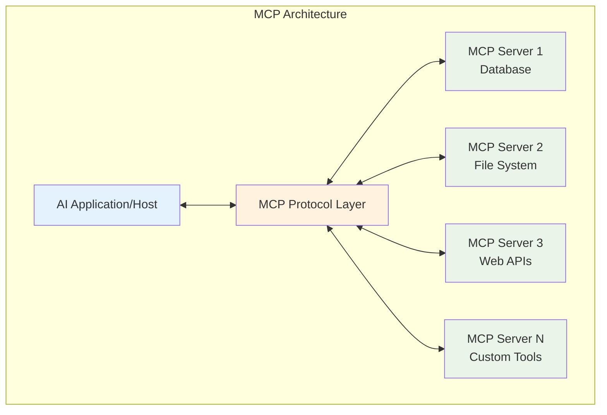

# Chapter 1: MCP Overview

## Introduction to Model Context Protocol (MCP)

The Model Context Protocol (MCP) is an emerging standard developed by Anthropic that enables seamless communication between AI models, applications, and external tools. Often described as "the USB for AI agents," MCP provides a standardized way for AI systems to interact with data sources, APIs, and services in a secure and interoperable manner.

## What is Model Context Protocol?

MCP is an open protocol that defines how AI applications can connect to external resources through a standardized interface. It abstracts the complexity of different data sources and APIs behind a common protocol, allowing AI models to access information and perform actions consistently across various platforms.

### Core Concepts



## Why MCP Matters

### The Problem MCP Solves

Before MCP, integrating AI models with external systems required:

- **Custom integrations** for each data source
- **Proprietary APIs** with different authentication methods
- **Inconsistent interfaces** across different tools
- **Security concerns** with direct data access
- **Maintenance overhead** for multiple connectors

### The MCP Solution

MCP provides:

- **Standardized Protocol**: Common interface for all integrations
- **Security Model**: Controlled access with proper permissions
- **Interoperability**: Works across different AI models and platforms
- **Scalability**: Easy to add new data sources and tools
- **Maintainability**: Single protocol to learn and maintain

## MCP Architecture Components

### 1. MCP Hosts (Clients)

Applications that consume MCP services:

```typescript
interface MCPHost {
  // Connect to MCP servers
  connect(serverConfig: ServerConfig): Promise<MCPConnection>;

  // Discover available resources
  listResources(): Promise<Resource[]>;

  // Execute operations
  callTool(toolName: string, parameters: any): Promise<any>;

  // Subscribe to updates
  subscribe(resourceUri: string): Promise<Subscription>;
}
```

**Examples of MCP Hosts:**

- Claude Desktop
- VS Code with MCP extension
- Custom AI applications
- Cursor IDE
- ChatGPT (planned)

### 2. MCP Servers

Services that expose resources and tools:

```typescript
interface MCPServer {
  // Server metadata
  getInfo(): ServerInfo;

  // Available resources (read-only data)
  listResources(): Resource[];
  readResource(uri: string): ResourceContent;

  // Available tools (actions)
  listTools(): Tool[];
  callTool(name: string, arguments: any): ToolResult;

  // Prompts (reusable templates)
  listPrompts(): Prompt[];
  getPrompt(name: string, arguments: any): PromptMessage[];
}
```

**Examples of MCP Servers:**

- Filesystem access
- Database connections
- Web search APIs
- Cloud service integrations
- Custom business logic

### 3. MCP Protocol

JSON-RPC 2.0 based protocol for communication:

```json
{
  "jsonrpc": "2.0",
  "id": 1,
  "method": "tools/call",
  "params": {
    "name": "search_database",
    "arguments": {
      "query": "SELECT * FROM users WHERE active = true",
      "limit": 10
    }
  }
}
```

## Core MCP Capabilities

### Resources

Read-only data sources that AI models can access:

```typescript
interface Resource {
  uri: string; // Unique identifier
  name: string; // Human-readable name
  description?: string; // Optional description
  mimeType?: string; // Content type
}

// Example: File system resource
const fileResource: Resource = {
  uri: "file:///home/user/documents/report.pdf",
  name: "Q4 Financial Report",
  description: "Quarterly financial analysis and projections",
  mimeType: "application/pdf",
};
```

### Tools

Executable functions that AI models can call:

```typescript
interface Tool {
  name: string;
  description: string;
  inputSchema: JSONSchema; // Parameters schema
}

// Example: Database query tool
const databaseTool: Tool = {
  name: "query_database",
  description: "Execute SQL queries against the customer database",
  inputSchema: {
    type: "object",
    properties: {
      query: {
        type: "string",
        description: "SQL query to execute",
      },
      limit: {
        type: "number",
        description: "Maximum number of results",
        default: 100,
      },
    },
    required: ["query"],
  },
};
```

### Prompts

Reusable prompt templates with parameters:

```typescript
interface Prompt {
  name: string;
  description: string;
  arguments?: PromptArgument[];
}

// Example: Code review prompt
const codeReviewPrompt: Prompt = {
  name: "code_review",
  description:
    "Comprehensive code review with security and performance analysis",
  arguments: [
    {
      name: "code",
      description: "Source code to review",
      required: true,
    },
    {
      name: "language",
      description: "Programming language",
      required: false,
    },
  ],
};
```

## MCP in Action: Examples

### Example 1: Database Integration

```typescript
// MCP Server for database access
class DatabaseMCPServer implements MCPServer {
  private db: DatabaseConnection;

  async callTool(name: string, args: any): Promise<ToolResult> {
    switch (name) {
      case "query_database":
        const results = await this.db.query(args.query, args.limit);
        return {
          content: [
            {
              type: "text",
              text: `Found ${results.length} results:\n${JSON.stringify(
                results,
                null,
                2
              )}`,
            },
          ],
        };

      case "get_schema":
        const schema = await this.db.getSchema();
        return {
          content: [
            {
              type: "text",
              text: `Database schema:\n${schema}`,
            },
          ],
        };

      default:
        throw new Error(`Unknown tool: ${name}`);
    }
  }

  listTools(): Tool[] {
    return [
      {
        name: "query_database",
        description: "Execute SQL queries",
        inputSchema: {
          type: "object",
          properties: {
            query: { type: "string" },
            limit: { type: "number", default: 100 },
          },
        },
      },
      {
        name: "get_schema",
        description: "Get database schema information",
        inputSchema: { type: "object" },
      },
    ];
  }
}
```

### Example 2: File System Access

```typescript
class FileSystemMCPServer implements MCPServer {
  async readResource(uri: string): Promise<ResourceContent> {
    const filePath = this.uriToPath(uri);

    // Security check - ensure path is allowed
    if (!this.isPathAllowed(filePath)) {
      throw new Error("Access denied");
    }

    const content = await fs.readFile(filePath, "utf-8");
    const mimeType = this.getMimeType(filePath);

    return {
      uri,
      mimeType,
      text: content,
    };
  }

  async callTool(name: string, args: any): Promise<ToolResult> {
    switch (name) {
      case "list_files":
        const files = await fs.readdir(args.directory);
        return {
          content: [
            {
              type: "text",
              text: `Files in ${args.directory}:\n${files.join("\n")}`,
            },
          ],
        };

      case "create_file":
        await fs.writeFile(args.path, args.content);
        return {
          content: [
            {
              type: "text",
              text: `File created: ${args.path}`,
            },
          ],
        };

      default:
        throw new Error(`Unknown tool: ${name}`);
    }
  }
}
```

## MCP Ecosystem

### Popular MCP Servers

| Server           | Purpose                  | Use Cases                          |
| ---------------- | ------------------------ | ---------------------------------- |
| **filesystem**   | File system access       | Document processing, code analysis |
| **postgres**     | PostgreSQL database      | Data analysis, reporting           |
| **github**       | GitHub API integration   | Code review, issue management      |
| **google-drive** | Google Drive access      | Document collaboration             |
| **slack**        | Slack messaging          | Team communication, notifications  |
| **web-search**   | Web search capabilities  | Research, fact-checking            |
| **kubernetes**   | Kubernetes management    | Infrastructure monitoring          |
| **aws**          | AWS services integration | Cloud resource management          |

### MCP Hosts and Clients

**Desktop Applications:**

- **Claude Desktop**: Native MCP support
- **VS Code**: Via MCP extension
- **Cursor**: Built-in MCP integration

**Development Frameworks:**

- **LangChain**: MCP tool integration
- **AutoGen**: Multi-agent with MCP
- **CrewAI**: MCP-enabled agents

**Custom Applications:**

```typescript
// Building a custom MCP host
class CustomMCPHost {
  private connections: Map<string, MCPConnection> = new Map();

  async connectToServer(config: ServerConfig): Promise<void> {
    const connection = await MCPClient.connect(config);
    this.connections.set(config.name, connection);

    // Discover available tools
    const tools = await connection.listTools();
    console.log(`Connected to ${config.name}, found ${tools.length} tools`);
  }

  async executeTask(serverName: string, toolName: string, params: any) {
    const connection = this.connections.get(serverName);
    if (!connection) {
      throw new Error(`No connection to server: ${serverName}`);
    }

    return await connection.callTool(toolName, params);
  }
}
```

## Benefits of MCP Adoption

### For Developers

1. **Reduced Integration Complexity**

   ```typescript
   // Without MCP: Different APIs for each service
   const dbResult = await database.query(sql);
   const fileContent = await filesystem.readFile(path);
   const searchResults = await searchAPI.search(query);

   // With MCP: Uniform interface
   const dbResult = await mcp.callTool("database", "query", { sql });
   const fileContent = await mcp.readResource("file://" + path);
   const searchResults = await mcp.callTool("search", "query", { query });
   ```

2. **Better Security Model**

   - Controlled access through MCP protocol
   - Permission-based resource access
   - Audit trails for all operations

3. **Improved Testing**

   ```typescript
   // Easy to mock MCP servers for testing
   const mockMCP = new MockMCPServer();
   mockMCP.addTool("database", "query", mockQueryResults);

   const agent = new AIAgent(mockMCP);
   const result = await agent.processRequest("Get user data");
   ```

### For Organizations

1. **Standardization**: Single protocol across all AI integrations
2. **Security**: Centralized access control and monitoring
3. **Scalability**: Easy to add new services and capabilities
4. **Maintenance**: Reduced complexity in AI system management

### For AI Model Providers

1. **Ecosystem Growth**: Rich set of available integrations
2. **User Experience**: Consistent interface across tools
3. **Innovation**: Focus on model capabilities rather than integrations

## Getting Started with MCP

### Setting Up Your First MCP Server

```bash
# Install MCP SDK
npm install @modelcontextprotocol/sdk

# Create a new MCP server
mkdir my-mcp-server
cd my-mcp-server
npm init -y
```

```typescript
// server.ts - Basic MCP server
import { Server } from "@modelcontextprotocol/sdk/server/index.js";
import { StdioServerTransport } from "@modelcontextprotocol/sdk/server/stdio.js";

const server = new Server(
  {
    name: "my-first-server",
    version: "1.0.0",
  },
  {
    capabilities: {
      tools: {},
      resources: {},
    },
  }
);

// Add a simple tool
server.setRequestHandler("tools/call", async (request) => {
  const { name, arguments: args } = request.params;

  if (name === "hello_world") {
    return {
      content: [
        {
          type: "text",
          text: `Hello, ${args.name || "World"}!`,
        },
      ],
    };
  }

  throw new Error(`Unknown tool: ${name}`);
});

// List available tools
server.setRequestHandler("tools/list", async () => {
  return {
    tools: [
      {
        name: "hello_world",
        description: "Say hello to someone",
        inputSchema: {
          type: "object",
          properties: {
            name: {
              type: "string",
              description: "Name to greet",
            },
          },
        },
      },
    ],
  };
});

// Start the server
const transport = new StdioServerTransport();
await server.connect(transport);
```

### Connecting to MCP from Applications

```typescript
// client.ts - Connecting to MCP server
import { Client } from "@modelcontextprotocol/sdk/client/index.js";
import { StdioClientTransport } from "@modelcontextprotocol/sdk/client/stdio.js";

const transport = new StdioClientTransport({
  command: "node",
  args: ["server.js"],
});

const client = new Client(
  {
    name: "my-client",
    version: "1.0.0",
  },
  {
    capabilities: {},
  }
);

await client.connect(transport);

// List available tools
const tools = await client.request({ method: "tools/list" }, { tools: [] });

console.log("Available tools:", tools);

// Call a tool
const result = await client.request(
  {
    method: "tools/call",
    params: {
      name: "hello_world",
      arguments: { name: "Alice" },
    },
  },
  { content: [] }
);

console.log("Result:", result);
```

## Real-World Use Cases

### 1. Customer Support Agent

```typescript
class CustomerSupportAgent {
  constructor(private mcp: MCPHost) {}

  async handleCustomerQuery(query: string, customerId: string) {
    // Get customer data
    const customer = await this.mcp.callTool("crm", "get_customer", {
      id: customerId,
    });

    // Search knowledge base
    const kbResults = await this.mcp.callTool("knowledge_base", "search", {
      query,
      category: "support",
    });

    // Check order status if relevant
    const orderQuery = this.extractOrderInfo(query);
    let orderInfo = null;
    if (orderQuery) {
      orderInfo = await this.mcp.callTool("orders", "get_status", orderQuery);
    }

    // Generate response with context
    return this.generateResponse(query, customer, kbResults, orderInfo);
  }
}
```

### 2. Development Assistant

```typescript
class DevAssistant {
  constructor(private mcp: MCPHost) {}

  async reviewPullRequest(prId: string) {
    // Get PR details from GitHub
    const pr = await this.mcp.callTool("github", "get_pull_request", {
      id: prId,
    });

    // Analyze code changes
    const files = await this.mcp.callTool("github", "get_pr_files", {
      id: prId,
    });

    // Run security scan
    const securityResults = await this.mcp.callTool(
      "security_scanner",
      "scan_changes",
      { files: files.map((f) => f.filename) }
    );

    // Check test coverage
    const coverage = await this.mcp.callTool("test_runner", "get_coverage", {
      branch: pr.head.ref,
    });

    return this.generateReview(pr, securityResults, coverage);
  }
}
```

## Future of MCP

### Upcoming Features

1. **Streaming Support**: Real-time data streaming
2. **Event Subscriptions**: Reactive updates from servers
3. **Advanced Security**: Fine-grained permissions
4. **Performance Optimizations**: Faster protocol implementations

### Industry Adoption

- **AI Model Providers**: OpenAI, Anthropic, Google planning support
- **Development Tools**: VS Code, JetBrains, Cursor integrating MCP
- **Enterprise Platforms**: Salesforce, ServiceNow building MCP servers
- **Cloud Providers**: AWS, Azure, GCP offering MCP-enabled services

## Key Takeaways

- **MCP standardizes** how AI models interact with external systems
- **Security and permissions** are built into the protocol design
- **Interoperability** enables reusing integrations across different AI applications
- **Growing ecosystem** of servers and hosts makes adoption easier
- **Simple architecture** reduces complexity compared to custom integrations
- **Future-proof** design accommodates evolving AI capabilities

MCP represents a fundamental shift toward standardized AI-tool integration, enabling the next generation of intelligent applications that can securely and efficiently access the digital world.

## Next Steps

In Chapter 2, we'll dive deeper into the **MCP Protocol Design**, exploring the technical specifications, message formats, and communication patterns that make MCP work.

---

## Navigation

- [← Introduction to MCP](./index)
- [Chapter 2: Protocol Design →](./protocol)
