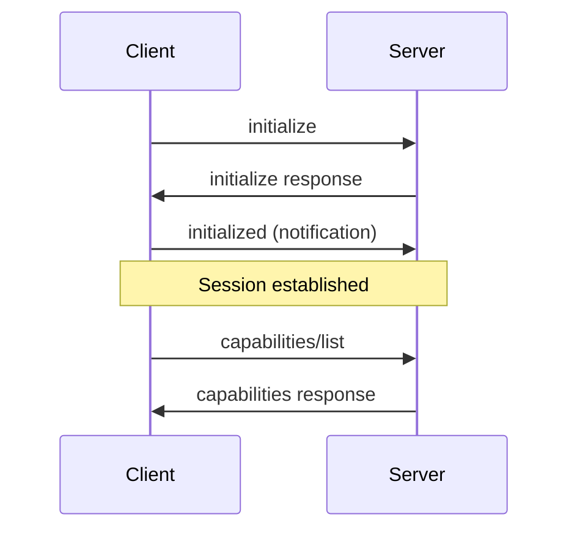

# Chapter 2: Protocol Design

## MCP Protocol Architecture

The Model Context Protocol is built on JSON-RPC 2.0, providing a robust, standardized communication layer between AI applications and external services. This chapter explores the technical details of the protocol design, message formats, and communication patterns.

## Protocol Foundations

### JSON-RPC 2.0 Base

MCP uses JSON-RPC 2.0 as its foundation, extending it with domain-specific methods and capabilities:

```json
{
  "jsonrpc": "2.0",
  "id": 1,
  "method": "initialize",
  "params": {
    "protocolVersion": "2024-11-05",
    "capabilities": {
      "roots": {
        "listChanged": true
      },
      "sampling": {}
    },
    "clientInfo": {
      "name": "ExampleClient",
      "version": "1.0.0"
    }
  }
}
```

### Transport Layer

MCP supports multiple transport mechanisms:

```typescript
// Stdio Transport (most common)
interface StdioTransport {
  input: NodeJS.ReadableStream;
  output: NodeJS.WritableStream;
}

// HTTP Transport
interface HTTPTransport {
  endpoint: string;
  headers?: Record<string, string>;
  authentication?: AuthConfig;
}

// WebSocket Transport
interface WebSocketTransport {
  url: string;
  protocols?: string[];
  headers?: Record<string, string>;
}
```

## Core Protocol Messages

### 1. Initialization Sequence

The MCP session begins with a handshake between client and server:



#### Initialize Request

```typescript
interface InitializeRequest {
  method: "initialize";
  params: {
    protocolVersion: string;
    capabilities: ClientCapabilities;
    clientInfo: {
      name: string;
      version: string;
    };
  };
}

interface ClientCapabilities {
  experimental?: Record<string, any>;
  sampling?: {};
  roots?: {
    listChanged?: boolean;
  };
}
```

#### Initialize Response

```typescript
interface InitializeResult {
  protocolVersion: string;
  capabilities: ServerCapabilities;
  serverInfo: {
    name: string;
    version: string;
  };
  instructions?: string;
}

interface ServerCapabilities {
  experimental?: Record<string, any>;
  logging?: {};
  prompts?: {
    listChanged?: boolean;
  };
  resources?: {
    subscribe?: boolean;
    listChanged?: boolean;
  };
  tools?: {
    listChanged?: boolean;
  };
}
```

### 2. Resource Management

Resources represent read-only data that clients can access:

#### List Resources

```json
{
  "jsonrpc": "2.0",
  "id": 2,
  "method": "resources/list"
}
```

```typescript
interface ListResourcesResult {
  resources: Resource[];
}

interface Resource {
  uri: string;
  name: string;
  description?: string;
  mimeType?: string;
}
```

#### Read Resource

```json
{
  "jsonrpc": "2.0",
  "id": 3,
  "method": "resources/read",
  "params": {
    "uri": "file:///home/user/document.pdf"
  }
}
```

```typescript
interface ReadResourceRequest {
  method: "resources/read";
  params: {
    uri: string;
  };
}

interface ReadResourceResult {
  contents: ResourceContents[];
}

type ResourceContents = TextResourceContents | BlobResourceContents;

interface TextResourceContents {
  uri: string;
  mimeType?: string;
  text: string;
}

interface BlobResourceContents {
  uri: string;
  mimeType?: string;
  blob: string; // Base64 encoded
}
```

### 3. Tool Execution

Tools represent executable functions:

#### List Tools

```json
{
  "jsonrpc": "2.0",
  "id": 4,
  "method": "tools/list"
}
```

```typescript
interface ListToolsResult {
  tools: Tool[];
}

interface Tool {
  name: string;
  description: string;
  inputSchema: {
    type: "object";
    properties?: Record<string, any>;
    required?: string[];
  };
}
```

#### Call Tool

```json
{
  "jsonrpc": "2.0",
  "id": 5,
  "method": "tools/call",
  "params": {
    "name": "search_files",
    "arguments": {
      "pattern": "*.py",
      "directory": "/home/user/project"
    }
  }
}
```

```typescript
interface CallToolRequest {
  method: "tools/call";
  params: {
    name: string;
    arguments?: Record<string, any>;
  };
}

interface CallToolResult {
  content: Content[];
  isError?: boolean;
}

type Content = TextContent | ImageContent | ResourceContent;

interface TextContent {
  type: "text";
  text: string;
}

interface ImageContent {
  type: "image";
  data: string; // Base64 encoded
  mimeType: string;
}

interface ResourceContent {
  type: "resource";
  resource: {
    uri: string;
    text?: string;
    blob?: string;
    mimeType?: string;
  };
}
```

### 4. Prompt Management

Prompts are reusable templates:

#### List Prompts

```json
{
  "jsonrpc": "2.0",
  "id": 6,
  "method": "prompts/list"
}
```

```typescript
interface ListPromptsResult {
  prompts: Prompt[];
}

interface Prompt {
  name: string;
  description: string;
  arguments?: PromptArgument[];
}

interface PromptArgument {
  name: string;
  description: string;
  required?: boolean;
}
```

#### Get Prompt

```json
{
  "jsonrpc": "2.0",
  "id": 7,
  "method": "prompts/get",
  "params": {
    "name": "code_review",
    "arguments": {
      "language": "python",
      "file": "main.py"
    }
  }
}
```

```typescript
interface GetPromptResult {
  description?: string;
  messages: PromptMessage[];
}

interface PromptMessage {
  role: "user" | "assistant" | "system";
  content: Content;
}
```

## Advanced Protocol Features

### 1. Subscriptions and Notifications

For real-time updates:

```typescript
// Subscribe to resource changes
interface SubscribeRequest {
  method: "resources/subscribe";
  params: {
    uri: string;
  };
}

// Notification when resource changes
interface ResourceUpdatedNotification {
  method: "notifications/resources/updated";
  params: {
    uri: string;
  };
}

// Unsubscribe
interface UnsubscribeRequest {
  method: "resources/unsubscribe";
  params: {
    uri: string;
  };
}
```

### 2. Progress Tracking

For long-running operations:

```typescript
interface ProgressNotification {
  method: "notifications/progress";
  params: {
    progressToken: ProgressToken;
    progress: number; // 0.0 to 1.0
    total?: number;
  };
}

interface CallToolWithProgressRequest {
  method: "tools/call";
  params: {
    name: string;
    arguments?: Record<string, any>;
    _meta?: {
      progressToken?: ProgressToken;
    };
  };
}
```

### 3. Completion Support

For interactive experiences:

```typescript
interface CompleteRequest {
  method: "completion/complete";
  params: {
    ref: {
      type: "ref/resource" | "ref/prompt";
      name: string;
    };
    argument: {
      name: string;
      value: string;
    };
  };
}

interface CompleteResult {
  completion: {
    values: string[];
    total?: number;
    hasMore?: boolean;
  };
}
```

## Protocol Implementation

### Server Implementation

```typescript
class MCPServer {
  private capabilities: ServerCapabilities;
  private tools: Map<string, Tool> = new Map();
  private resources: Map<string, Resource> = new Map();
  private prompts: Map<string, Prompt> = new Map();

  constructor(info: ServerInfo, capabilities: ServerCapabilities) {
    this.capabilities = capabilities;
  }

  // Handle initialization
  async handleInitialize(params: InitializeParams): Promise<InitializeResult> {
    return {
      protocolVersion: "2024-11-05",
      capabilities: this.capabilities,
      serverInfo: {
        name: "My MCP Server",
        version: "1.0.0",
      },
    };
  }

  // Handle tool calls
  async handleToolCall(params: CallToolParams): Promise<CallToolResult> {
    const tool = this.tools.get(params.name);
    if (!tool) {
      throw new Error(`Unknown tool: ${params.name}`);
    }

    // Validate arguments against schema
    this.validateArguments(params.arguments, tool.inputSchema);

    // Execute tool
    return await this.executeTool(params.name, params.arguments);
  }

  // Register a tool
  registerTool(name: string, tool: Tool, handler: ToolHandler) {
    this.tools.set(name, tool);
    this.toolHandlers.set(name, handler);
  }

  // Register a resource
  registerResource(
    uri: string,
    resource: Resource,
    provider: ResourceProvider
  ) {
    this.resources.set(uri, resource);
    this.resourceProviders.set(uri, provider);
  }

  private validateArguments(args: any, schema: JSONSchema): void {
    // Implement JSON schema validation
    const validator = new JSONSchemaValidator(schema);
    if (!validator.validate(args)) {
      throw new Error(`Invalid arguments: ${validator.errors}`);
    }
  }
}
```

### Client Implementation

```typescript
class MCPClient {
  private connection: Connection;
  private requestId = 0;
  private pendingRequests = new Map<number, PendingRequest>();

  async connect(transport: Transport): Promise<void> {
    this.connection = new Connection(transport);

    // Set up message handlers
    this.connection.onMessage(this.handleMessage.bind(this));

    // Initialize the connection
    await this.initialize();
  }

  private async initialize(): Promise<void> {
    const result = await this.request({
      method: "initialize",
      params: {
        protocolVersion: "2024-11-05",
        capabilities: {
          roots: { listChanged: true },
          sampling: {},
        },
        clientInfo: {
          name: "My MCP Client",
          version: "1.0.0",
        },
      },
    });

    // Send initialized notification
    await this.notify({
      method: "notifications/initialized",
    });
  }

  async listTools(): Promise<Tool[]> {
    const result = await this.request({
      method: "tools/list",
    });
    return result.tools;
  }

  async callTool(name: string, arguments?: any): Promise<CallToolResult> {
    return await this.request({
      method: "tools/call",
      params: { name, arguments },
    });
  }

  async readResource(uri: string): Promise<ResourceContents[]> {
    const result = await this.request({
      method: "resources/read",
      params: { uri },
    });
    return result.contents;
  }

  private async request(request: any): Promise<any> {
    const id = ++this.requestId;
    const message = { jsonrpc: "2.0", id, ...request };

    return new Promise((resolve, reject) => {
      this.pendingRequests.set(id, { resolve, reject });
      this.connection.send(message);
    });
  }

  private async notify(notification: any): Promise<void> {
    const message = { jsonrpc: "2.0", ...notification };
    this.connection.send(message);
  }

  private handleMessage(message: any): void {
    if (message.id && this.pendingRequests.has(message.id)) {
      const pending = this.pendingRequests.get(message.id)!;
      this.pendingRequests.delete(message.id);

      if (message.error) {
        pending.reject(new Error(message.error.message));
      } else {
        pending.resolve(message.result);
      }
    } else if (message.method) {
      // Handle notifications and requests from server
      this.handleNotification(message);
    }
  }
}
```

## Security Model

### Authentication

```typescript
interface AuthConfig {
  type: "bearer" | "basic" | "api-key";
  credentials: string | { username: string; password: string };
}

// Bearer token authentication
const authConfig: AuthConfig = {
  type: "bearer",
  credentials: "eyJhbGciOiJIUzI1NiIsInR5cCI6IkpXVCJ9...",
};

// API key authentication
const apiKeyAuth: AuthConfig = {
  type: "api-key",
  credentials: "sk-1234567890abcdef",
};
```

### Permission Model

```typescript
interface PermissionConfig {
  resources: {
    allowed: string[]; // URI patterns
    denied: string[];
  };
  tools: {
    allowed: string[];
    denied: string[];
  };
  maxResourceSize?: number;
  maxToolExecutionTime?: number;
}

class PermissionManager {
  constructor(private config: PermissionConfig) {}

  canAccessResource(uri: string): boolean {
    // Check against allowed/denied patterns
    const isAllowed = this.config.resources.allowed.some((pattern) =>
      this.matchesPattern(uri, pattern)
    );
    const isDenied = this.config.resources.denied.some((pattern) =>
      this.matchesPattern(uri, pattern)
    );

    return isAllowed && !isDenied;
  }

  canExecuteTool(toolName: string): boolean {
    const isAllowed =
      this.config.tools.allowed.includes(toolName) ||
      this.config.tools.allowed.includes("*");
    const isDenied = this.config.tools.denied.includes(toolName);

    return isAllowed && !isDenied;
  }
}
```

## Error Handling

### Standard Error Codes

```typescript
enum MCPErrorCode {
  // Standard JSON-RPC errors
  ParseError = -32700,
  InvalidRequest = -32600,
  MethodNotFound = -32601,
  InvalidParams = -32602,
  InternalError = -32603,

  // MCP-specific errors
  InvalidResource = -32001,
  ResourceNotFound = -32002,
  ToolNotFound = -32003,
  ToolExecutionError = -32004,
  PermissionDenied = -32005,
}

interface MCPError {
  code: MCPErrorCode;
  message: string;
  data?: any;
}

// Error response format
interface ErrorResponse {
  jsonrpc: "2.0";
  id: number | string | null;
  error: MCPError;
}
```

### Error Handling Implementation

```typescript
class ErrorHandler {
  static handleToolError(error: Error, toolName: string): MCPError {
    if (error instanceof PermissionError) {
      return {
        code: MCPErrorCode.PermissionDenied,
        message: `Permission denied for tool: ${toolName}`,
        data: { tool: toolName },
      };
    }

    if (error instanceof ValidationError) {
      return {
        code: MCPErrorCode.InvalidParams,
        message: `Invalid parameters for tool: ${toolName}`,
        data: { validation_errors: error.details },
      };
    }

    return {
      code: MCPErrorCode.ToolExecutionError,
      message: `Tool execution failed: ${error.message}`,
      data: { tool: toolName, stack: error.stack },
    };
  }

  static handleResourceError(error: Error, uri: string): MCPError {
    if (error instanceof NotFoundError) {
      return {
        code: MCPErrorCode.ResourceNotFound,
        message: `Resource not found: ${uri}`,
        data: { uri },
      };
    }

    if (error instanceof AccessDeniedError) {
      return {
        code: MCPErrorCode.PermissionDenied,
        message: `Access denied to resource: ${uri}`,
        data: { uri },
      };
    }

    return {
      code: MCPErrorCode.InvalidResource,
      message: `Resource error: ${error.message}`,
      data: { uri, error: error.message },
    };
  }
}
```

## Protocol Extensions

### Custom Capabilities

```typescript
interface CustomCapabilities {
  experimental?: {
    // Custom streaming support
    streaming?: {
      tools?: boolean;
      resources?: boolean;
    };

    // Custom batch operations
    batch?: {
      maxSize?: number;
      timeout?: number;
    };

    // Custom caching
    caching?: {
      ttl?: number;
      maxSize?: number;
    };
  };
}

// Implementing custom streaming
interface StreamingToolRequest {
  method: "tools/call";
  params: {
    name: string;
    arguments?: any;
    _experimental?: {
      stream: boolean;
    };
  };
}

interface StreamingToolResponse {
  jsonrpc: "2.0";
  id: number;
  result: {
    content: Content[];
    _experimental?: {
      streamId: string;
      hasMore: boolean;
    };
  };
}
```

## Performance Considerations

### Message Batching

```typescript
interface BatchRequest {
  jsonrpc: "2.0";
  id: number;
  method: "batch/execute";
  params: {
    requests: MCPRequest[];
  };
}

interface BatchResponse {
  jsonrpc: "2.0";
  id: number;
  result: {
    responses: (MCPResponse | MCPError)[];
  };
}

class BatchProcessor {
  async processBatch(
    requests: MCPRequest[]
  ): Promise<(MCPResponse | MCPError)[]> {
    const results = await Promise.allSettled(
      requests.map((req) => this.processRequest(req))
    );

    return results.map((result) =>
      result.status === "fulfilled" ? result.value : result.reason
    );
  }
}
```

### Connection Pooling

```typescript
class ConnectionPool {
  private connections: Map<string, Connection[]> = new Map();
  private maxConnections = 10;

  async getConnection(serverConfig: ServerConfig): Promise<Connection> {
    const key = this.getConnectionKey(serverConfig);
    const connections = this.connections.get(key) || [];

    // Reuse existing connection if available
    const available = connections.find((conn) => !conn.busy);
    if (available) {
      return available;
    }

    // Create new connection if under limit
    if (connections.length < this.maxConnections) {
      const newConnection = await this.createConnection(serverConfig);
      connections.push(newConnection);
      this.connections.set(key, connections);
      return newConnection;
    }

    // Wait for connection to become available
    return this.waitForConnection(key);
  }
}
```

## Key Takeaways

- **JSON-RPC 2.0** provides a solid foundation for MCP communication
- **Type-safe interfaces** ensure reliable client-server interactions
- **Flexible transport** supports various deployment scenarios
- **Security model** enables controlled access to resources and tools
- **Error handling** provides clear feedback for debugging and monitoring
- **Extensions** allow for custom capabilities while maintaining compatibility
- **Performance optimizations** enable efficient operation at scale

The MCP protocol design balances simplicity with powerful capabilities, making it easy to implement while supporting sophisticated AI-tool integrations.

## Next Steps

Chapter 3 will cover the **Implementation Guide**, showing how to build production-ready MCP servers and clients with real-world examples.

---

## Navigation

- [← Chapter 1: MCP Overview](./overview)
- [Chapter 3: Implementation Guide →](./implementation)
