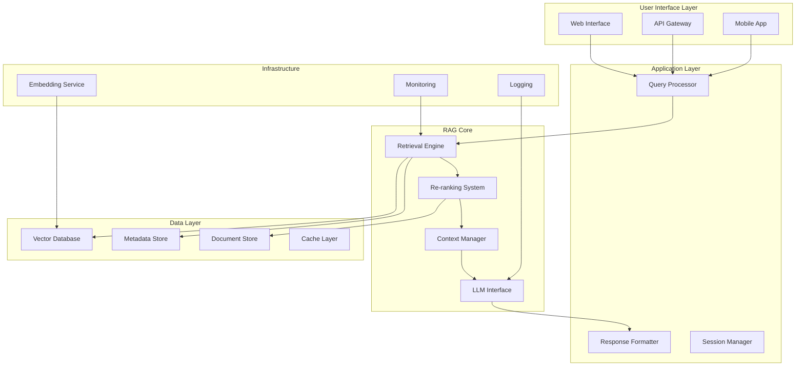

# Chapter 2: RAG Architecture

## System Architecture Overview

A production-ready RAG system consists of multiple interconnected components working together to provide accurate, contextual responses. Understanding the architecture is crucial for building scalable and maintainable RAG applications.

## RAG System Architecture



## Detailed Component Architecture

### 1. Data Ingestion Pipeline

The foundation of any RAG system is a robust data ingestion pipeline that processes raw documents into searchable embeddings.

**Pipeline Stages**:

```python
class DataIngestionPipeline:
    def __init__(self):
        self.document_processor = DocumentProcessor()
        self.chunker = TextChunker()
        self.embedding_generator = EmbeddingGenerator()
        self.vector_store = VectorStore()
        self.metadata_extractor = MetadataExtractor()

    async def ingest_document(self, document_path):
        # Stage 1: Document Processing
        raw_text = await self.document_processor.extract_text(document_path)

        # Stage 2: Metadata Extraction
        metadata = self.metadata_extractor.extract(document_path, raw_text)

        # Stage 3: Text Chunking
        chunks = self.chunker.chunk_text(raw_text, metadata)

        # Stage 4: Embedding Generation
        embeddings = await self.embedding_generator.generate_batch(chunks)

        # Stage 5: Storage
        await self.vector_store.upsert_batch(chunks, embeddings, metadata)

        return {"status": "success", "chunks_processed": len(chunks)}
```

**Document Processing Components**:

```python
class DocumentProcessor:
    def __init__(self):
        self.processors = {
            '.pdf': PDFProcessor(),
            '.docx': WordProcessor(),
            '.md': MarkdownProcessor(),
            '.html': HTMLProcessor(),
            '.txt': TextProcessor()
        }

    async def extract_text(self, document_path):
        file_extension = Path(document_path).suffix.lower()
        processor = self.processors.get(file_extension)

        if not processor:
            raise UnsupportedFileType(f"No processor for {file_extension}")

        return await processor.extract(document_path)

class PDFProcessor:
    def extract(self, pdf_path):
        # Extract text while preserving structure
        # Handle tables, images, headers, footers
        pass

class MarkdownProcessor:
    def extract(self, md_path):
        # Parse markdown structure
        # Preserve headers, code blocks, links
        pass
```

### 2. Text Chunking Strategies

Effective chunking is critical for retrieval quality. Different strategies work better for different content types.

**Fixed-Size Chunking**:

```python
class FixedSizeChunker:
    def __init__(self, chunk_size=500, overlap=50):
        self.chunk_size = chunk_size
        self.overlap = overlap

    def chunk_text(self, text):
        chunks = []
        start = 0

        while start < len(text):
            end = start + self.chunk_size
            chunk = text[start:end]
            chunks.append(chunk)
            start = end - self.overlap

        return chunks
```

**Semantic Chunking**:

```python
class SemanticChunker:
    def __init__(self, sentence_model, similarity_threshold=0.7):
        self.sentence_model = sentence_model
        self.similarity_threshold = similarity_threshold

    def chunk_text(self, text):
        sentences = self.split_sentences(text)
        sentence_embeddings = self.sentence_model.encode(sentences)

        chunks = []
        current_chunk = [sentences[0]]

        for i in range(1, len(sentences)):
            similarity = cosine_similarity(
                sentence_embeddings[i-1:i],
                sentence_embeddings[i:i+1]
            )[0][0]

            if similarity >= self.similarity_threshold:
                current_chunk.append(sentences[i])
            else:
                chunks.append(" ".join(current_chunk))
                current_chunk = [sentences[i]]

        if current_chunk:
            chunks.append(" ".join(current_chunk))

        return chunks
```

**Hierarchical Chunking**:

```python
class HierarchicalChunker:
    def __init__(self):
        self.section_chunker = SectionChunker()
        self.paragraph_chunker = ParagraphChunker()
        self.sentence_chunker = SentenceChunker()

    def chunk_document(self, document):
        # Create multi-level hierarchy
        sections = self.section_chunker.chunk(document)

        hierarchy = {}
        for section in sections:
            paragraphs = self.paragraph_chunker.chunk(section)
            hierarchy[section.id] = {
                'content': section,
                'paragraphs': paragraphs,
                'sentences': []
            }

            for paragraph in paragraphs:
                sentences = self.sentence_chunker.chunk(paragraph)
                hierarchy[section.id]['sentences'].extend(sentences)

        return hierarchy
```

### 3. Embedding and Vector Storage

**Embedding Model Selection**:

```python
class EmbeddingManager:
    def __init__(self):
        self.models = {
            'openai': OpenAIEmbeddings(),
            'sentence_transformers': SentenceTransformerEmbeddings(),
            'cohere': CohereEmbeddings(),
            'custom': CustomEmbeddings()
        }
        self.active_model = None

    def select_model(self, model_name, **kwargs):
        if model_name not in self.models:
            raise ValueError(f"Unknown model: {model_name}")

        self.active_model = self.models[model_name]
        return self.active_model.initialize(**kwargs)

    async def generate_embeddings(self, texts, batch_size=100):
        if not self.active_model:
            raise RuntimeError("No embedding model selected")

        embeddings = []
        for i in range(0, len(texts), batch_size):
            batch = texts[i:i + batch_size]
            batch_embeddings = await self.active_model.embed(batch)
            embeddings.extend(batch_embeddings)

        return embeddings
```

**Vector Database Integration**:

```python
class VectorStoreManager:
    def __init__(self):
        self.stores = {
            'pinecone': PineconeStore(),
            'weaviate': WeaviateStore(),
            'chroma': ChromaStore(),
            'qdrant': QdrantStore()
        }

    def initialize_store(self, store_type, config):
        store = self.stores.get(store_type)
        if not store:
            raise ValueError(f"Unsupported store type: {store_type}")

        return store.initialize(config)

class PineconeStore:
    def __init__(self):
        self.index = None

    def initialize(self, config):
        import pinecone

        pinecone.init(
            api_key=config['api_key'],
            environment=config['environment']
        )

        self.index = pinecone.Index(config['index_name'])
        return self

    async def upsert_batch(self, vectors, metadata_batch):
        # Batch upsert for efficiency
        batch_data = [
            (f"doc_{i}", vector, metadata)
            for i, (vector, metadata) in enumerate(zip(vectors, metadata_batch))
        ]

        return await self.index.upsert(batch_data)

    async def search(self, query_vector, top_k=10, filter_dict=None):
        results = await self.index.query(
            vector=query_vector,
            top_k=top_k,
            filter=filter_dict,
            include_metadata=True
        )

        return results['matches']
```

### 4. Retrieval Engine Architecture

**Multi-Stage Retrieval**:

```python
class MultiStageRetriever:
    def __init__(self):
        self.stages = [
            CandidateGenerationStage(),
            ReRankingStage(),
            ContextOptimizationStage()
        ]

    async def retrieve(self, query, user_context=None):
        candidates = query

        for stage in self.stages:
            candidates = await stage.process(candidates, user_context)

        return candidates

class CandidateGenerationStage:
    def __init__(self):
        self.sparse_retriever = BM25Retriever()
        self.dense_retriever = DenseRetriever()
        self.hybrid_fusion = HybridFusion()

    async def process(self, query, user_context):
        # Parallel retrieval
        sparse_results = await self.sparse_retriever.retrieve(query)
        dense_results = await self.dense_retriever.retrieve(query)

        # Fusion and deduplication
        fused_results = self.hybrid_fusion.fuse(
            sparse_results,
            dense_results,
            weights={'sparse': 0.3, 'dense': 0.7}
        )

        return fused_results

class ReRankingStage:
    def __init__(self):
        self.cross_encoder = CrossEncoder('ms-marco-MiniLM-L-6-v2')
        self.diversity_filter = DiversityFilter()

    async def process(self, candidates, user_context):
        # Cross-encoder re-ranking
        query = candidates['query']
        docs = candidates['documents']

        pairs = [(query, doc.content) for doc in docs]
        scores = self.cross_encoder.predict(pairs)

        # Combine with diversity
        reranked = self.diversity_filter.apply(docs, scores)

        return {
            'query': query,
            'documents': reranked,
            'stage': 'reranked'
        }
```

### 5. Context Management

**Context Assembly**:

```python
class ContextManager:
    def __init__(self, max_context_length=4000):
        self.max_context_length = max_context_length
        self.compressor = ContextCompressor()
        self.formatter = ContextFormatter()

    def assemble_context(self, query, retrieved_docs, conversation_history=None):
        # Calculate available space
        query_tokens = self.count_tokens(query)
        history_tokens = self.count_tokens(conversation_history) if conversation_history else 0
        available_tokens = self.max_context_length - query_tokens - history_tokens - 200  # Buffer

        # Prioritize and fit documents
        prioritized_docs = self.prioritize_documents(retrieved_docs, query)
        fitted_docs = self.fit_documents_to_context(prioritized_docs, available_tokens)

        # Format context
        context = self.formatter.format_context(
            query=query,
            documents=fitted_docs,
            history=conversation_history
        )

        return context

    def prioritize_documents(self, docs, query):
        # Score documents by relevance, recency, authority
        scores = []
        for doc in docs:
            relevance_score = doc.similarity_score
            recency_score = self.calculate_recency_score(doc.timestamp)
            authority_score = self.calculate_authority_score(doc.source)

            combined_score = (
                0.6 * relevance_score +
                0.2 * recency_score +
                0.2 * authority_score
            )
            scores.append((doc, combined_score))

        return sorted(scores, key=lambda x: x[1], reverse=True)

    def fit_documents_to_context(self, prioritized_docs, available_tokens):
        fitted_docs = []
        used_tokens = 0

        for doc, score in prioritized_docs:
            doc_tokens = self.count_tokens(doc.content)

            if used_tokens + doc_tokens <= available_tokens:
                fitted_docs.append(doc)
                used_tokens += doc_tokens
            else:
                # Try compression
                compressed_doc = self.compressor.compress(
                    doc,
                    target_tokens=available_tokens - used_tokens
                )
                if compressed_doc:
                    fitted_docs.append(compressed_doc)
                break

        return fitted_docs
```

### 6. LLM Integration

**Model Orchestration**:

```python
class LLMOrchestrator:
    def __init__(self):
        self.models = {
            'gpt-4': GPT4Interface(),
            'claude-3': Claude3Interface(),
            'llama-2': Llama2Interface(),
            'gemini-pro': GeminiInterface()
        }
        self.fallback_chain = ['gpt-4', 'claude-3', 'gemini-pro']
        self.prompt_manager = PromptManager()

    async def generate_response(self, query, context, model_preference=None):
        prompt = self.prompt_manager.build_rag_prompt(query, context)

        # Try preferred model first, then fallback chain
        models_to_try = [model_preference] + self.fallback_chain if model_preference else self.fallback_chain

        for model_name in models_to_try:
            try:
                model = self.models[model_name]
                response = await model.generate(prompt)

                # Validate response quality
                if self.validate_response(response, query, context):
                    return {
                        'response': response,
                        'model_used': model_name,
                        'prompt_tokens': len(prompt.split()),
                        'context_sources': [doc.id for doc in context['documents']]
                    }
            except Exception as e:
                logger.warning(f"Model {model_name} failed: {e}")
                continue

        raise RuntimeError("All models failed to generate response")

class PromptManager:
    def __init__(self):
        self.templates = {
            'default': self.load_template('default_rag.txt'),
            'conversational': self.load_template('conversational_rag.txt'),
            'analytical': self.load_template('analytical_rag.txt'),
            'creative': self.load_template('creative_rag.txt')
        }

    def build_rag_prompt(self, query, context, template_type='default'):
        template = self.templates[template_type]

        context_str = self.format_context_for_prompt(context)

        return template.format(
            context=context_str,
            query=query,
            timestamp=datetime.now().isoformat()
        )

    def format_context_for_prompt(self, context):
        formatted_docs = []

        for i, doc in enumerate(context['documents'], 1):
            doc_text = f"""
Source {i}: {doc.title}
Content: {doc.content}
Relevance: {doc.similarity_score:.2f}
"""
            formatted_docs.append(doc_text)

        return "\n".join(formatted_docs)
```

This architectural overview provides the foundation for building production-ready RAG systems. In the next chapter, we'll dive into hands-on implementation with specific code examples and best practices.
