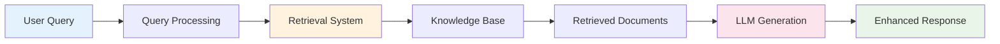

# Chapter 1: RAG Fundamentals

## What is Retrieval Augmented Generation?

**Retrieval Augmented Generation (RAG)** is a technique that combines the generative capabilities of Large Language Models with the precision of information retrieval systems. RAG enhances LLM responses by first retrieving relevant information from external knowledge sources, then using that information to generate more accurate, contextual, and up-to-date responses.

## The RAG Process

### Basic RAG Workflow



### Step-by-Step Process

1. **Query Processing**: User question is analyzed and potentially reformulated
2. **Information Retrieval**: Relevant documents are found using search algorithms
3. **Context Assembly**: Retrieved information is formatted for LLM consumption
4. **Response Generation**: LLM generates answer using both query and retrieved context
5. **Response Delivery**: Enhanced, grounded response is returned to user

## Core Components of RAG

### 1. Knowledge Base

**Purpose**: Store and organize information for retrieval

**Types**:

- **Structured**: Databases, knowledge graphs
- **Unstructured**: Documents, web pages, PDFs
- **Semi-structured**: JSON, XML, markdown files

**Examples**:

```python
# Document example
document = {
    "id": "doc_001",
    "title": "AI Agent Architecture",
    "content": "AI agents consist of perception, reasoning, and action components...",
    "metadata": {
        "author": "John Doe",
        "created": "2024-01-15",
        "category": "technical"
    }
}
```

### 2. Embedding Model

**Purpose**: Convert text into numerical vectors for semantic search

**Popular Models**:

- **OpenAI text-embedding-ada-002**: High quality, commercial
- **Sentence Transformers**: Open source, specialized models
- **Cohere Embed**: Multilingual, commercial
- **BGE Models**: BAAI general embeddings, open source

**Vector Representation**:

```python
# Text to vector conversion
text = "What is an AI agent?"
embedding = embedding_model.encode(text)
# Result: [0.1, -0.3, 0.7, ..., 0.2] (768 or 1536 dimensions)
```

### 3. Vector Database

**Purpose**: Store and efficiently search through embeddings

**Key Features**:

- **Similarity Search**: Find vectors closest to query vector
- **Scalability**: Handle millions of vectors efficiently
- **Filtering**: Metadata-based filtering capabilities
- **Real-time Updates**: Add/update vectors dynamically

**Popular Options**:

- **Pinecone**: Managed, cloud-native
- **Weaviate**: Open source, GraphQL API
- **Chroma**: Lightweight, Python-native
- **Qdrant**: Rust-based, high performance

### 4. Retrieval Algorithm

**Purpose**: Find most relevant information for given query

**Common Approaches**:

**Sparse Retrieval (BM25)**:

```python
def bm25_score(query_terms, document, corpus_stats):
    score = 0
    for term in query_terms:
        tf = document.count(term)  # Term frequency
        idf = log(N / df[term])    # Inverse document frequency
        score += idf * (tf * (k1 + 1)) / (tf + k1 * (1 - b + b * |d|/avgdl))
    return score
```

**Dense Retrieval (Vector Search)**:

```python
def dense_retrieval(query_embedding, document_embeddings):
    similarities = cosine_similarity(query_embedding, document_embeddings)
    return sorted(enumerate(similarities), key=lambda x: x[1], reverse=True)
```

**Hybrid Retrieval**:

```python
def hybrid_retrieval(query, alpha=0.7):
    sparse_scores = bm25_search(query)
    dense_scores = vector_search(query)

    # Combine scores
    combined_scores = {}
    for doc_id in set(sparse_scores.keys()) | set(dense_scores.keys()):
        sparse_score = sparse_scores.get(doc_id, 0)
        dense_score = dense_scores.get(doc_id, 0)
        combined_scores[doc_id] = alpha * dense_score + (1 - alpha) * sparse_score

    return sorted(combined_scores.items(), key=lambda x: x[1], reverse=True)
```

### 5. Language Model

**Purpose**: Generate responses using retrieved context

**Integration Pattern**:

```python
def generate_rag_response(query, retrieved_docs, llm):
    context = "\n".join([doc.content for doc in retrieved_docs])

    prompt = f"""
    Context information:
    {context}

    Question: {query}

    Based on the context provided, answer the question. If the context doesn't contain enough information, say so.
    """

    return llm.generate(prompt)
```

## RAG vs Alternative Approaches

### RAG vs Fine-tuning

| Aspect                   | RAG                         | Fine-tuning                   |
| ------------------------ | --------------------------- | ----------------------------- |
| **Knowledge Updates**    | Real-time updates possible  | Requires retraining           |
| **Implementation Speed** | Quick to implement          | Time-intensive training       |
| **Computational Cost**   | Lower ongoing cost          | High training cost            |
| **Accuracy**             | Good with quality retrieval | Can be highly accurate        |
| **Interpretability**     | High (can see sources)      | Lower (black box)             |
| **Domain Adaptation**    | Easy to add new domains     | Requires domain-specific data |

### RAG vs Prompt Engineering

| Aspect                    | RAG                        | Prompt Engineering        |
| ------------------------- | -------------------------- | ------------------------- |
| **Context Length**        | Dynamically retrieved      | Limited by model context  |
| **Information Freshness** | Always current             | Static in prompts         |
| **Scalability**           | Scales with knowledge base | Limited by prompt size    |
| **Accuracy**              | Grounded in real data      | Depends on prompt quality |
| **Maintenance**           | Update knowledge base      | Update prompts            |

### RAG vs Knowledge Graphs

| Aspect                    | RAG                    | Knowledge Graphs         |
| ------------------------- | ---------------------- | ------------------------ |
| **Query Complexity**      | Natural language       | Structured queries       |
| **Relationship Modeling** | Implicit in text       | Explicit relationships   |
| **Setup Complexity**      | Moderate               | High (entity extraction) |
| **Flexibility**           | High (any text format) | Structured data focused  |
| **Reasoning**             | LLM-based              | Graph algorithms         |

## Benefits of RAG

### 1. **Reduced Hallucinations**

RAG grounds responses in actual retrieved documents, significantly reducing the likelihood of generating false information.

**Example**:

```
Without RAG:
Q: "What is the current population of Tokyo?"
A: "The population of Tokyo is approximately 14 million." (Potentially outdated)

With RAG:
Q: "What is the current population of Tokyo?"
Retrieved: "According to the 2024 census, Tokyo's population is 13.9 million..."
A: "Based on the latest 2024 census data, Tokyo's population is 13.9 million."
```

### 2. **Up-to-Date Information**

Knowledge base can be updated without retraining the model.

### 3. **Domain Expertise**

Can incorporate specialized knowledge not present in the base model.

### 4. **Transparency**

Users can see what sources were used to generate responses.

### 5. **Cost Efficiency**

More economical than fine-tuning for many use cases.

## Common Use Cases

### 1. **Customer Support**

```python
class CustomerSupportRAG:
    def __init__(self):
        self.knowledge_base = load_support_docs()
        self.vector_store = create_vector_store(self.knowledge_base)

    def answer_support_query(self, customer_question):
        relevant_docs = self.vector_store.search(customer_question, k=3)

        context = self.format_support_context(relevant_docs)

        prompt = f"""
        You are a helpful customer support agent. Use the following support documentation to answer the customer's question.

        Support Documentation:
        {context}

        Customer Question: {customer_question}

        Provide a helpful, accurate response based on the documentation. If you need additional information, ask clarifying questions.
        """

        return self.llm.generate(prompt)
```

### 2. **Research Assistant**

```python
class ResearchRAG:
    def __init__(self, research_corpus):
        self.corpus = research_corpus
        self.vector_store = self.build_research_index()

    def research_query(self, research_question):
        # Multi-step retrieval for comprehensive research
        initial_results = self.vector_store.search(research_question, k=10)

        # Expand search with related terms
        expanded_results = self.expand_search(initial_results)

        # Synthesize comprehensive response
        return self.synthesize_research_findings(
            research_question,
            initial_results + expanded_results
        )
```

### 3. **Legal Document Analysis**

```python
class LegalRAG:
    def __init__(self):
        self.case_law_db = load_case_law()
        self.statutes_db = load_statutes()
        self.legal_vector_store = create_legal_index()

    def legal_analysis(self, legal_question):
        relevant_cases = self.search_case_law(legal_question)
        relevant_statutes = self.search_statutes(legal_question)

        return self.generate_legal_analysis(
            legal_question,
            relevant_cases,
            relevant_statutes
        )
```

## RAG Challenges and Solutions

### Challenge 1: **Retrieval Quality**

**Problem**: Retrieved documents may not be relevant or comprehensive

**Solutions**:

- Improve query processing and expansion
- Use hybrid retrieval (sparse + dense)
- Implement re-ranking algorithms
- Optimize chunking strategies

### Challenge 2: **Context Length Limitations**

**Problem**: LLMs have limited context windows

**Solutions**:

- Intelligent document summarization
- Hierarchical retrieval approaches
- Context compression techniques
- Multi-turn retrieval strategies

### Challenge 3: **Knowledge Base Maintenance**

**Problem**: Keeping knowledge base current and accurate

**Solutions**:

- Automated content ingestion pipelines
- Version control for documents
- Regular quality audits
- Incremental updating strategies

### Challenge 4: **Performance and Scalability**

**Problem**: Real-time retrieval can be slow at scale

**Solutions**:

- Optimize vector database configuration
- Implement caching strategies
- Use approximate nearest neighbor algorithms
- Parallel processing for retrieval

## Evaluation Metrics

### Retrieval Metrics

**Precision@K**: Proportion of relevant documents in top K results

```python
def precision_at_k(retrieved_docs, relevant_docs, k):
    top_k = retrieved_docs[:k]
    relevant_retrieved = len(set(top_k) & set(relevant_docs))
    return relevant_retrieved / k
```

**Recall@K**: Proportion of relevant documents retrieved in top K

```python
def recall_at_k(retrieved_docs, relevant_docs, k):
    top_k = retrieved_docs[:k]
    relevant_retrieved = len(set(top_k) & set(relevant_docs))
    return relevant_retrieved / len(relevant_docs)
```

**Mean Reciprocal Rank (MRR)**: Average of reciprocal ranks of first relevant document

```python
def mrr(queries_results, relevant_docs_per_query):
    mrr_sum = 0
    for i, results in enumerate(queries_results):
        for rank, doc in enumerate(results, 1):
            if doc in relevant_docs_per_query[i]:
                mrr_sum += 1 / rank
                break
    return mrr_sum / len(queries_results)
```

### Generation Metrics

**BLEU Score**: Measures n-gram overlap with reference answers
**ROUGE Score**: Measures recall-oriented overlap
**BERTScore**: Semantic similarity using BERT embeddings
**Faithfulness**: How well response is grounded in retrieved context

## Getting Started: Simple RAG Implementation

```python
import numpy as np
from sentence_transformers import SentenceTransformer
from sklearn.metrics.pairwise import cosine_similarity

class SimpleRAG:
    def __init__(self, documents, llm_client):
        self.documents = documents
        self.llm_client = llm_client
        self.embedding_model = SentenceTransformer('all-MiniLM-L6-v2')

        # Create embeddings for all documents
        self.doc_embeddings = self.embedding_model.encode(
            [doc['content'] for doc in documents]
        )

    def retrieve(self, query, k=3):
        # Encode query
        query_embedding = self.embedding_model.encode([query])

        # Calculate similarities
        similarities = cosine_similarity(query_embedding, self.doc_embeddings)[0]

        # Get top k most similar documents
        top_k_indices = np.argsort(similarities)[::-1][:k]

        return [self.documents[i] for i in top_k_indices]

    def generate_response(self, query):
        # Retrieve relevant documents
        retrieved_docs = self.retrieve(query)

        # Format context
        context = "\n\n".join([
            f"Document {i+1}: {doc['content']}"
            for i, doc in enumerate(retrieved_docs)
        ])

        # Generate response
        prompt = f"""
        Context:
        {context}

        Question: {query}

        Based on the provided context, answer the question accurately.
        """

        return self.llm_client.generate(prompt)

# Usage example
documents = [
    {"id": 1, "content": "AI agents are autonomous systems..."},
    {"id": 2, "content": "RAG combines retrieval with generation..."},
    {"id": 3, "content": "Vector databases store embeddings..."}
]

rag_system = SimpleRAG(documents, llm_client)
response = rag_system.generate_response("What are AI agents?")
```

## Key Takeaways

1. **RAG enhances LLMs** by providing relevant, current information
2. **Core components** include knowledge base, embeddings, vector store, retrieval, and generation
3. **RAG offers advantages** over fine-tuning for many use cases
4. **Quality retrieval** is crucial for RAG system success
5. **Evaluation metrics** help measure and improve performance
6. **Implementation** can start simple and grow in sophistication

## What's Next?

In **Chapter 2: RAG Architecture**, we'll dive deeper into the technical architecture and design patterns for building robust RAG systems.
